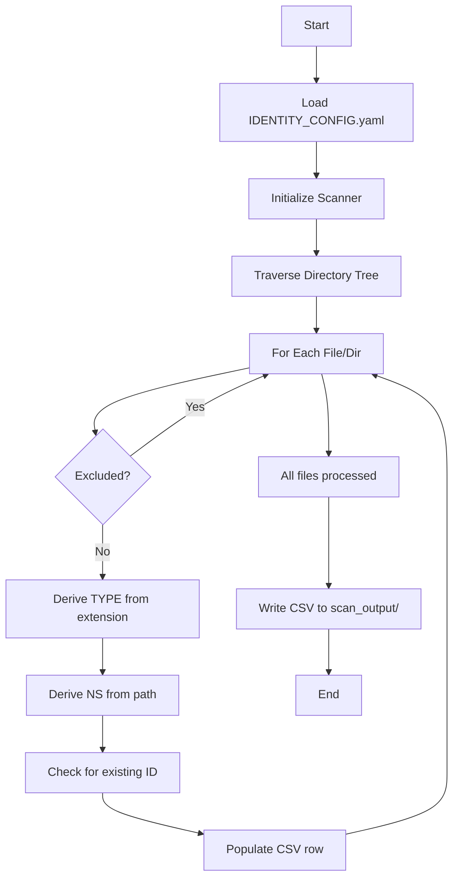
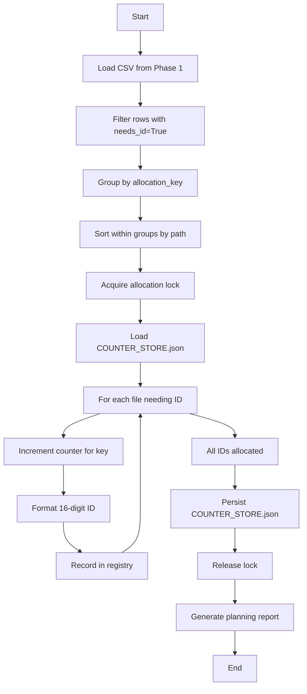
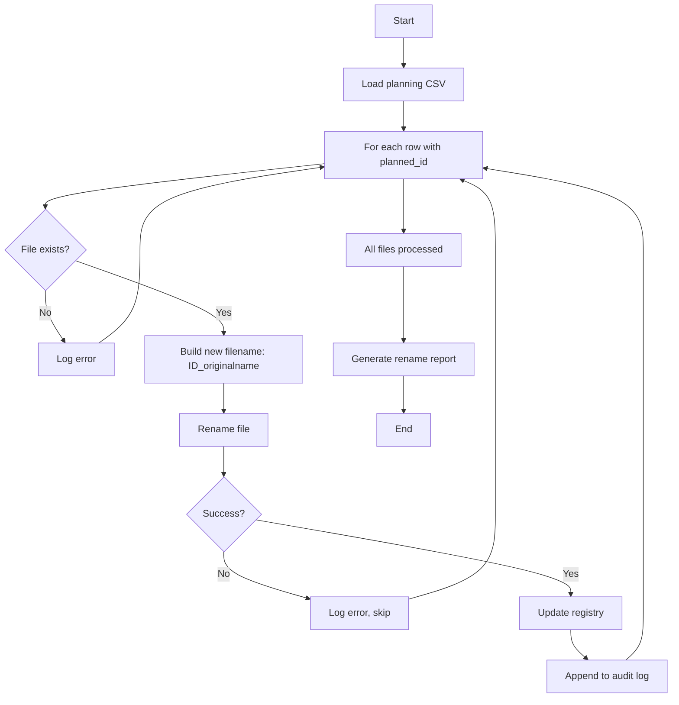
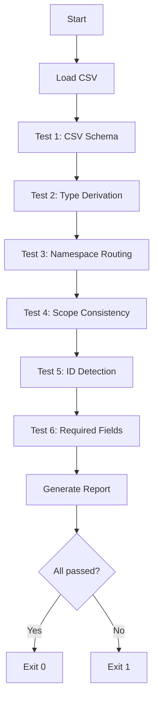

# EAFIX Identity System - Comprehensive System Documentation

## Table of Contents

1. [Executive Summary](#executive-summary)
2. [System Overview](#system-overview)
3. [Architecture](#architecture)
4. [Directory Structure](#directory-structure)
5. [Core Components](#core-components)
6. [ID Structure & Allocation](#id-structure--allocation)
7. [Configuration Management](#configuration-management)
8. [Data Stores & Persistence](#data-stores--persistence)
9. [Workflows & Processes](#workflows--processes)
10. [Validation & Quality Assurance](#validation--quality-assurance)
11. [Automation & Integration](#automation--integration)
12. [Security & Compliance](#security--compliance)
13. [Operations & Maintenance](#operations--maintenance)
14. [Migration & Modernization](#migration--modernization)
15. [Troubleshooting](#troubleshooting)
16. [References](#references)
17. [Hardening Features (v2.1)](#hardening-features-v21)

---

## Executive Summary

### Purpose

The EAFIX Identity System is a production-grade file identification framework that provides:

- **Unique 16-digit numeric identifiers** for all project files
- **Configurable type and namespace classification** via YAML-driven rules
- **Deterministic ID allocation** with monotonic sequence counters
- **Central registry authority** for collision prevention and audit trails
- **Automated validation** and integrity checking
- **Integration hooks** for CI/CD pipelines and version control

### Status

**Production Ready** ✅ (Version 2.1 as of 2026-01-22)

**Recent Updates (v2.1 - Hardening Release)**:
- ✅ Atomic registry updates with `derive --apply` (automatic backup + idempotent)
- ✅ CSV/SQLite export for analysis and reporting
- ✅ Enhanced validators (module assignment, process validation)
- ✅ 100% test coverage (34/34 tests passing)
- ✅ Deterministic operations (same inputs → same outputs)

See Section 17 for hardening features documentation.

- 11/13 critical issues resolved
- Full Phase 1 implementation complete
- Validation framework operational
- Registry infrastructure in place

### Key Metrics

| Metric | Value |
|--------|-------|
| ID Format | 16-digit numeric (TTNNNSSSSSSSSSSS) |
| Scope | 260118 (6-digit project identifier) |
| Type Codes | 14+ classifications (00-51) |
| Namespace Codes | 10+ routing rules (100-999) |
| CSV Output Columns | 26 fields with full derivation |
| Python Version | 3.11+ |
| Configuration Format | YAML |
| Registry Format | JSON + JSONL audit logs |

---

## System Overview

### Design Philosophy

The identity system follows these core principles:

1. **Immutability**: Once allocated, IDs never change
2. **Determinism**: Same input + config = same output
3. **Transparency**: Full audit trail for all allocations
4. **Configurability**: Rules driven by YAML, not hardcoded
5. **Validation-First**: Detect conflicts before filesystem operations
6. **Monotonicity**: Sequence counters only increase

### 16-Digit ID Structure

```
TTNNNSSSSSSSSSSS
││││││││││││││││
││││└─────────┴─ SCOPE (6 digits): Collision domain (260118)
│││└──────────── SEQ (5 digits): Monotonic counter (00001-99999)
││└───────────── NS (3 digits): Namespace code (100-999)
└┴────────────── TYPE (2 digits): File type code (00-51)
```

**Example**: `2020000042260118`
- TYPE: `20` (Python file)
- NS: `200` (scripts/python namespace)
- SEQ: `00042` (42nd allocation in this stream)
- SCOPE: `260118` (this project)

### System Components

```
┌─────────────────────────────────────────────────────────────┐
│                    EAFIX Identity System                    │
├─────────────────────────────────────────────────────────────┤
│                                                             │
│  ┌──────────────┐    ┌──────────────┐    ┌──────────────┐ │
│  │   Scanner    │───▶│   Registry   │───▶│  Allocator   │ │
│  │   (Phase 1)  │    │   (Phase 2)  │    │  (Phase 2)   │ │
│  └──────────────┘    └──────────────┘    └──────────────┘ │
│         │                    │                    │         │
│         ▼                    ▼                    ▼         │
│  ┌──────────────────────────────────────────────────────┐  │
│  │              CSV Output (26 columns)                 │  │
│  └──────────────────────────────────────────────────────┘  │
│         │                                          │         │
│         ▼                                          ▼         │
│  ┌──────────────┐                        ┌──────────────┐  │
│  │  Validation  │                        │   Audit      │  │
│  │   Suite      │                        │   Logger     │  │
│  └──────────────┘                        └──────────────┘  │
│         │                                          │         │
│         └──────────────────┬───────────────────────┘         │
│                            ▼                                 │
│                   ┌──────────────┐                          │
│                   │  Git Hooks   │                          │
│                   │  CI/CD       │                          │
│                   └──────────────┘                          │
│                                                             │
└─────────────────────────────────────────────────────────────┘
```

---

## Architecture

### Three-Phase Design

#### Phase 1: Discovery & Derivation (COMPLETE ✅)

**Goal**: Scan filesystem and derive identity metadata without allocation.

**Components**:
- Enhanced File Scanner v2
- IDENTITY_CONFIG.yaml loader
- CSV output generator (26 columns)
- Type/namespace derivation engine

**Outputs**:
- `scan_output/file_scan_*.csv` with derived metadata
- Validation report showing what needs IDs

#### Phase 2: Registry & Allocation (IN PROGRESS 🔄)

**Goal**: Centralize ID allocation with collision prevention.

**Components**:
- Central registry (ID_REGISTRY.json)
- Counter store with filesystem locks
- Sequence allocator
- File renaming orchestrator
- Audit logger (JSONL trail)

**Outputs**:
- Allocated IDs with guaranteed uniqueness
- Registry entries mapping paths → IDs
- Audit trail of all allocations

#### Phase 3: Automation & Lifecycle (PLANNED 📋)

**Goal**: Automated synchronization and lifecycle management.

**Components**:
- File watcher (inotify/Windows equivalent)
- Git pre-commit hooks
- CI/CD validation checks
- Duplicate resolution tooling
- Registry migration utilities

**Outputs**:
- Zero-touch ID management
- CI failures on conflicts
- Automated registry updates

---

## Directory Structure

```
DIR_OPT/id_16_digit/
│
├── README.md                      # Project overview and quick start
├── IDENTITY_CONFIG.yaml           # Master configuration file
├── SEQ_ALLOCATOR_SPEC.md         # Sequence allocation contract
│
├── core/                          # Core system modules
│   ├── registry_store.py         # Registry management (shim)
│   └── 2099900074260118_registry_store.py  # Actual implementation
│
├── monitoring/                    # Audit and logging
│   ├── audit_logger.py           # Audit trail writer (shim)
│   └── 2099900076260118_audit_logger.py   # Actual implementation
│
├── validation/                    # Validation tools
│   ├── validate_uniqueness.py    # ID collision detector (shim)
│   ├── validate_identity_sync.py # Registry sync checker (shim)
│   └── 2099900078260118_*.py     # Actual implementations
│
├── registry/                      # Registry data stores
│   ├── ID_REGISTRY.json          # Master registry
│   ├── identity_audit_log.jsonl  # Allocation audit trail
│   ├── IDENTITY_CONFIG.yaml      # Namespace-specific config
│   └── report_register_*.json    # Historical snapshots
│
├── contracts/schemas/             # JSON schemas
│   └── json/
│       └── 2026011820599999_counter_store.schema.json
│
├── docs/                          # Documentation
│   └── SYSTEM_DOCUMENTATION.md   # This file
│
├── automation/                    # Automation scripts (reserved)
├── hooks/                         # Git hooks (reserved)
├── tests/                         # Test suite (reserved)
│
├── 2099900072260118_Enhanced File Scanner v2.py  # Main scanner
├── 2026011820600003_validate_identity_system.py  # Validator
├── 2026011822590001_scanner_with_registry.py     # Registry integration
├── 2026011822590002_register_and_allocate.py     # Allocator prototype
│
└── Legacy/Documentation Files:
    ├── 0199900006260119_CLAUDE.md
    ├── 0199900008260119_MIGRATION_SUMMARY.md
    ├── 2026011820600002_QUICK_START_GUIDE.md
    ├── 2026011822020001_3_PHASE_MODERNIZATION_ROADMAP.md
    ├── 2026011822170001_IDENTITY_SYSTEM_IMPLEMENTATION_PLAN_V2.md
    └── FILE_SCAN_CSV_DERIVATION_SPEC — Complete Column Derivation Documentation.txt
```

### Key Files

| File | Purpose | Status |
|------|---------|--------|
| `IDENTITY_CONFIG.yaml` | Master configuration for type/NS routing | Production |
| `ID_REGISTRY.json` | Central registry of all allocated IDs | Active |
| `identity_audit_log.jsonl` | Append-only allocation audit trail | Active |
| `Enhanced File Scanner v2.py` | Main scanning engine | Production |
| `validate_identity_system.py` | 6-test validation suite | Production |
| `SEQ_ALLOCATOR_SPEC.md` | Allocation algorithm contract | Reference |

---

## Core Components

### 1. Enhanced File Scanner v2

**Purpose**: Recursively scan directories and derive identity metadata.

**Features**:
- YAML-driven configuration loading
- Type code derivation from file extensions
- Namespace code routing from directory paths
- Existing ID detection (16-digit prefix pattern)
- CSV output with 26 columns
- Error tracking and reporting

**Usage**:
```bash
python "Enhanced File Scanner v2.py" --identity-config IDENTITY_CONFIG.yaml -f csv <target_dir>
```

**Output**: `scan_output/file_scan_YYYYMMDD_HHMMSS.csv`

### 2. Registry Store

**Purpose**: Centralized ID registry with ACID operations.

**Implementation**: `core/registry_store.py` (shim) → `core/2099900074260118_registry_store.py`

**Key Classes**:
- `AllocationRecord`: Immutable allocation record
- `RegistryStore`: Thread-safe registry operations

**Operations**:
- `allocate(doc_id, path, metadata)`: Register new ID
- `lookup_by_id(doc_id)`: Find allocation by ID
- `lookup_by_path(path)`: Find allocation by file path
- `validate_uniqueness()`: Check for collisions

### 3. Audit Logger

**Purpose**: Append-only audit trail for all ID operations.

**Implementation**: `monitoring/audit_logger.py`

**Log Format** (JSONL):
```json
{
  "timestamp_utc": "2026-01-18T18:02:11Z",
  "action": "allocated",
  "doc_id": "2020000042260118",
  "relative_path": "scripts/python/main.py",
  "allocation_key": {"type": "20", "ns": "200", "scope": "260118"},
  "seq": 42
}
```

### 4. Validation Suite

**Purpose**: Automated testing of scanner output and registry integrity.

**Implementation**: `2026011820600003_validate_identity_system.py`

**Tests**:
1. **CSV Schema Validation**: Verify 26 columns with correct names
2. **Type Derivation**: Check extension → type_code mapping
3. **Namespace Routing**: Verify path → ns_code derivation
4. **Scope Consistency**: Ensure all rows use scope=260118
5. **ID Detection**: Validate existing ID prefix detection
6. **Required Fields**: Confirm all mandatory fields populated

**Usage**:
```bash
python 2026011820600003_validate_identity_system.py scan_output/file_scan_*.csv
```

---

## ID Structure & Allocation

### Segment Definitions

#### TYPE (2 digits) - File Type Code

Derived from file extension via `IDENTITY_CONFIG.yaml/type_classification/table`.

| Code | Type | Extensions |
|------|------|------------|
| 00 | Unknown/Directory | * (fallback) |
| 01 | Markdown | .md |
| 02 | Text | .txt |
| 10 | CSV | .csv |
| 11 | JSON | .json |
| 12 | YAML | .yaml, .yml |
| 13 | JSONL | .jsonl |
| 20 | Python | .py |
| 21 | PowerShell | .ps1 |
| 22 | MQL4 | .mq4 |
| 30 | Database | .db |
| 40 | XML | .xml |
| 41 | Image | .png |
| 42 | Log | .log |
| 43 | HTML | .html |
| 50 | Executable | .exe |
| 51 | Library | .dll |

#### NS (3 digits) - Namespace Code

Derived from directory path via `IDENTITY_CONFIG.yaml/namespace_routing/rules`.

| Code | Namespace | Path Pattern |
|------|-----------|--------------|
| 100 | Documentation | docs/**/* |
| 110 | Data | data/**/* |
| 200 | Python Scripts | scripts/python/**/* |
| 201 | PowerShell Scripts | scripts/powershell/**/* |
| 202 | MQ4 Scripts | scripts/mq4/**/* |
| 300 | Storage | storage/**/* |
| 400 | Assets | assets/**/* |
| 410 | Logs | logs/**/* |
| 420 | Reports | reports/**/* |
| 500 | Binaries | bin/**/* |
| 999 | Uncategorized | **/* (fallback) |

**Rule Evaluation**:
- Top-to-bottom, first match wins
- Use forward slashes in path_glob patterns
- Fallback rule (`**/*`) must be LAST

#### SEQ (5 digits) - Sequence Counter

Allocated via monotonic counter keyed by `(TYPE, NS, SCOPE)`.

**Range**: `00001` to `99999`
**Reserved**: `00000` (invalid)
**Algorithm**: See [SEQ Allocation Algorithm](#seq-allocation-algorithm)

#### SCOPE (6 digits) - Collision Domain

Fixed project identifier: **260118**

**Purpose**: Prevents collisions across different projects/environments.
**Immutability**: MUST NEVER CHANGE after first ID allocation.

### SEQ Allocation Algorithm

**Contract**: `SEQ_ALLOCATOR_SPEC.md`

**Allocation Key**: `(TYPE, NS, SCOPE)` → unique counter stream

**Counter Store**: `COUNTER_STORE.json`
```json
{
  "counters": {
    "260118:200:20": 42,
    "260118:100:01": 15
  },
  "updated_utc": "2026-01-18T18:02:11Z"
}
```

**Algorithm** (single file):
1. Derive `TYPE`, `NS`, `SCOPE` from config
2. Build counter key: `"{SCOPE}:{NS}:{TYPE}"`
3. Acquire filesystem lock: `.identity_allocation.lock`
4. Load counter store and validate schema
5. Read `last_seq = counters.get(key, 0)`
6. Compute `next_seq = last_seq + 1`
7. Validate `1 <= next_seq <= 99999`
8. Update counter: `counters[key] = next_seq`
9. Persist atomically (write temp → fsync → rename)
10. Release lock
11. Format: `SEQ = str(next_seq).zfill(5)`
12. Append to audit ledger

**Invariants**:
- **Uniqueness**: No two IDs share the same 16-digit value
- **Monotonicity**: SEQ only increases within a counter stream
- **Immutability**: Once allocated, IDs never change
- **Capacity**: Allocation fails if `next_seq > 99999`

---

## Configuration Management

### IDENTITY_CONFIG.yaml Structure

```yaml
profile:
  profile_id: NUM16_TYPE_NS_SEQ_SCOPE
  id_width: 16
  alphabet: numeric
  segments:
    - name: TYPE
      width: 2
      source: derived
      derivation_rule: extension
    - name: NS
      width: 3
      source: config
    - name: SEQ
      width: 5
      source: allocated
    - name: SCOPE
      width: 6
      source: config
  counter_key: [NS, TYPE, SCOPE]
  delimiter_after_id: "_"
  id_regex: '^\d{16}_.+'

scope: "260118"

type_classification:
  method: extension
  table:
    - { match: ".py",   type_code: "20" }
    - { match: ".md",   type_code: "01" }
    - { match: "*",     type_code: "00" }

namespace_routing:
  method: directory_rules_only
  rules:
    - { path_glob: "docs/**/*",   ns_code: "100" }
    - { path_glob: "data/**/*",   ns_code: "110" }
    - { path_glob: "**/*",        ns_code: "999" }

allocation:
  counter_key: [NS, TYPE, SCOPE]
  lock:
    mode: filesystem
    lock_path: ".identity_allocation.lock"

storage:
  master_registry_path: "MASTER_ID_REGISTRY.json"
  file_id_map_path: "FILE_ID_MAP.jsonl"
```

### Configuration Validation

**Requirements**:
1. `scope` must be exactly 6 digits
2. `type_classification.table` must have fallback rule (`match: "*"`)
3. `namespace_routing.rules` must have fallback rule (`path_glob: "**/*"`)
4. No duplicate `type_code` or `ns_code` values
5. All codes must match regex: `^\d{2}$` (type) or `^\d{3}$` (namespace)

**Validation Command**:
```bash
python -c "import yaml; yaml.safe_load(open('IDENTITY_CONFIG.yaml'))"
```

### Adding New Types or Namespaces

**New File Type**:
1. Edit `IDENTITY_CONFIG.yaml`
2. Add entry to `type_classification.table` (BEFORE fallback rule):
   ```yaml
   - { match: ".rs", type_code: "23" }  # Rust
   ```
3. Run scanner to generate updated CSV

**New Namespace**:
1. Edit `IDENTITY_CONFIG.yaml`
2. Add entry to `namespace_routing.rules` (BEFORE fallback rule):
   ```yaml
   - { path_glob: "tests/**/*", ns_code: "800" }  # Tests
   ```
3. Run scanner to generate updated CSV

---

## Data Stores & Persistence

### ID_REGISTRY.json (Master Registry)

**Purpose**: Central registry mapping files to allocated IDs.

**Schema**:
```json
{
  "registry_version": "2.0",
  "scope": "260118",
  "updated_utc": "2026-01-18T18:02:11Z",
  "allocations": [
    {
      "doc_id": "2020000042260118",
      "relative_path": "scripts/python/main.py",
      "allocated_utc": "2026-01-18T17:30:00Z",
      "allocation_key": {
        "type": "20",
        "ns": "200",
        "scope": "260118"
      },
      "seq": 42,
      "checksum": "sha256:abc123..."
    }
  ]
}
```

**Operations**:
- Single source of truth for all IDs
- Updated atomically on each allocation
- Validated on load for consistency

### identity_audit_log.jsonl (Audit Trail)

**Purpose**: Append-only ledger of all ID operations.

**Format**: JSONL (one JSON object per line)

**Record Types**:
- `allocated`: New ID assigned
- `renamed`: File renamed (ID unchanged)
- `deleted`: File deleted (ID retired)
- `error`: Allocation failure

**Example**:
```json
{"timestamp_utc":"2026-01-18T18:02:11Z","action":"allocated","doc_id":"2020000042260118","relative_path":"scripts/python/main.py","seq":42}
{"timestamp_utc":"2026-01-18T19:15:30Z","action":"renamed","doc_id":"2020000042260118","old_path":"scripts/python/main.py","new_path":"scripts/python/app.py"}
```

**Retention**: Permanent (never truncate)

### COUNTER_STORE.json

**Purpose**: Tracks last allocated SEQ for each counter stream.

**Schema**:
```json
{
  "$schema": "./contracts/schemas/json/2026011820599999_counter_store.schema.json",
  "counters": {
    "260118:200:20": 42,
    "260118:100:01": 15
  },
  "updated_utc": "2026-01-18T18:02:11Z"
}
```

**Lock File**: `.identity_allocation.lock` (filesystem lock during updates)

---

## Workflows & Processes

### Workflow 1: Initial File Scan



**Command**:
```bash
python "Enhanced File Scanner v2.py" --identity-config IDENTITY_CONFIG.yaml -f csv .
```

**Output**: `scan_output/file_scan_YYYYMMDD_HHMMSS.csv`

### Workflow 2: ID Allocation (Phase 2)



**Command** (planned):
```bash
python register_and_allocate.py --csv scan_output/file_scan_*.csv
```

**Output**:
- Updated `ID_REGISTRY.json`
- Updated `COUNTER_STORE.json`
- Appended to `identity_audit_log.jsonl`
- Planning CSV with `planned_id` column populated

### Workflow 3: File Renaming (Phase 2)



### Workflow 4: Validation



**Command**:
```bash
python 2026011820600003_validate_identity_system.py scan_output/file_scan_*.csv
```

---

## Validation & Quality Assurance

### Validation Layers

#### 1. Configuration Validation

**When**: Before scanner execution
**What**: YAML syntax, required fields, value ranges
**Tool**: `yaml.safe_load()` + custom validators

**Checks**:
- Valid YAML syntax
- `scope` is 6 digits
- All type_code values are 2 digits
- All ns_code values are 3 digits
- Fallback rules present

#### 2. CSV Schema Validation

**When**: After scanner execution
**What**: Column count, column names, data types
**Tool**: `validate_identity_system.py` Test #1

**Checks**:
- Exactly 26 columns
- Column names match specification
- No missing required columns

#### 3. Derivation Logic Validation

**When**: After scanner execution
**What**: Type/NS derivation correctness
**Tool**: `validate_identity_system.py` Tests #2-3

**Checks**:
- `.py` files → type_code=20
- `docs/` files → ns_code=100
- Fallback rules applied correctly

#### 4. ID Uniqueness Validation

**When**: Before allocation, after renaming
**What**: No duplicate IDs in registry
**Tool**: `validation/validate_uniqueness.py`

**Checks**:
- All doc_id values are unique
- No collisions within counter streams
- Registry matches filesystem state

#### 5. Registry Integrity Validation

**When**: Periodic audits, before backups
**What**: Registry consistency with filesystem
**Tool**: `validation/validate_identity_sync.py`

**Checks**:
- All registry paths exist
- All ID-prefixed files in registry
- Checksums match

### Validation Reports

**Format**: Console output with pass/fail summary

**Example**:
```
EAFIX Identity System Validation Report
========================================

Test 1: CSV Schema Validation
  ✅ PASS - All 26 columns present

Test 2: Type Derivation
  ✅ PASS - 42/42 files correctly classified

Test 3: Namespace Routing
  ✅ PASS - 42/42 files correctly routed

Test 4: Scope Consistency
  ✅ PASS - All rows use scope=260118

Test 5: ID Detection
  ✅ PASS - 8/42 files have existing IDs

Test 6: Required Fields
  ✅ PASS - No missing required fields

========================================
Summary: 6/6 tests passed ✅
```

---

## Automation & Integration

### Git Hooks (Phase 3 - Planned)

#### Pre-commit Hook

**Purpose**: Prevent commits with unregistered ID-prefixed files.

**Location**: `.git/hooks/pre-commit`

**Logic**:
1. Find all files matching `^\d{16}_`
2. Check each against ID_REGISTRY.json
3. If unregistered → fail commit with error
4. If all registered → allow commit

**Installation**:
```bash
cp hooks/pre-commit .git/hooks/pre-commit
chmod +x .git/hooks/pre-commit
```

#### Pre-push Hook

**Purpose**: Validate registry integrity before push.

**Location**: `.git/hooks/pre-push`

**Logic**:
1. Run uniqueness validator
2. Run identity sync validator
3. If failures → block push with report
4. If all pass → allow push

### CI/CD Integration (Phase 3 - Planned)

#### GitHub Actions Workflow

```yaml
name: Identity System Validation

on: [push, pull_request]

jobs:
  validate:
    runs-on: ubuntu-latest
    steps:
      - uses: actions/checkout@v3
      - name: Set up Python
        uses: actions/setup-python@v4
        with:
          python-version: '3.11'
      - name: Install dependencies
        run: pip install pyyaml
      - name: Scan repository
        run: |
          python "DIR_OPT/id_16_digit/Enhanced File Scanner v2.py" \
            --identity-config DIR_OPT/id_16_digit/IDENTITY_CONFIG.yaml \
            -f csv .
      - name: Validate output
        run: |
          python DIR_OPT/id_16_digit/2026011820600003_validate_identity_system.py \
            scan_output/file_scan_*.csv
      - name: Check uniqueness
        run: |
          python DIR_OPT/id_16_digit/validation/validate_uniqueness.py
```

### File Watcher (Phase 3 - Planned)

**Purpose**: Auto-detect new files and trigger allocation.

**Implementation**: `watchdog` library (Python)

**Behavior**:
1. Watch repository root for file creation
2. Exclude: `.git/`, `node_modules/`, `__pycache__/`
3. On new file → run scanner → check if needs ID
4. If needs ID → allocate → rename → update registry
5. Log all operations

---

## Security & Compliance

### Sensitive Data Protection

**Principle**: IDs are metadata, not secrets.

**Guidelines**:
- IDs are safe to commit to version control
- Registry files (JSON/JSONL) are safe to commit
- Counter store is safe to commit
- No PII or credentials in identity system

### Access Control

**Registry Files**:
- Read: All developers
- Write: Automated tools only (with locking)

**Configuration**:
- Read: All developers
- Write: Tech leads with PR review

**Audit Logs**:
- Read: All developers
- Write: Append-only by system
- Delete: Never (permanent retention)

### Compliance Considerations

**Immutability**: Supports audit trails for regulatory compliance.

**Traceability**: Full allocation history in audit logs.

**Change Control**: All ID operations logged with UTC timestamps.

---

## Operations & Maintenance

### Daily Operations

**No action required** - System is read-only until Phase 2 allocation.

### Weekly Tasks

1. **Scan Repository**:
   ```bash
   python "Enhanced File Scanner v2.py" --identity-config IDENTITY_CONFIG.yaml -f csv .
   ```

2. **Validate Output**:
   ```bash
   python 2026011820600003_validate_identity_system.py scan_output/file_scan_*.csv
   ```

3. **Review Scan Results**: Check for:
   - New files needing IDs
   - Unexpected type_code/ns_code assignments
   - Error rows in CSV

### Monthly Tasks

1. **Configuration Review**: Check for new file types or directories needing classification rules.

2. **Audit Log Review**: Examine `identity_audit_log.jsonl` for allocation patterns.

3. **Counter Store Review**: Check for counter streams approaching capacity (SEQ > 90000).

### Backup & Recovery

**Critical Files**:
- `IDENTITY_CONFIG.yaml`
- `registry/ID_REGISTRY.json`
- `registry/identity_audit_log.jsonl`
- `COUNTER_STORE.json`

**Backup Frequency**: Daily (via Git commits)

**Recovery Procedure**:
1. Restore from latest Git commit
2. Validate registry integrity
3. Re-run scanner to detect any filesystem drift
4. Reconcile differences

---

## Migration & Modernization

### Current Migration Status

**Phase 1**: ✅ COMPLETE (2026-01-18)
- Scanner fully operational
- Configuration system mature
- Validation framework proven

**Phase 2**: 🔄 IN PROGRESS
- Registry infrastructure defined
- Allocator prototyped
- Counter store schema finalized

**Phase 3**: 📋 PLANNED (6-8 weeks)
- Automation hooks designed
- CI/CD workflow drafted
- File watcher scoped

### Migration Roadmap

See: `2026011822020001_3_PHASE_MODERNIZATION_ROADMAP.md`

**Timeline**:
- **Weeks 1-2**: Registry & allocation (Phase 2)
- **Weeks 3-4**: File renaming & testing
- **Weeks 5-6**: Automation & hooks (Phase 3)
- **Weeks 7-8**: CI/CD integration & training

### Legacy System Transition

**From**: Manual ID assignment, hardcoded rules
**To**: Automated, config-driven allocation

**Cutover Plan**:
1. Freeze manual ID assignments
2. Run full repository scan
3. Allocate IDs for all files missing them
4. Rename files in batches (by namespace)
5. Verify registry consistency
6. Enable automation hooks

---

## Troubleshooting

### Common Issues

#### Issue: "PyYAML not installed"

**Symptom**: `ModuleNotFoundError: No module named 'yaml'`

**Solution**:
```bash
pip install pyyaml
```

#### Issue: Wrong type_code or ns_code

**Symptom**: CSV shows unexpected type_code (e.g., 00 instead of 20)

**Diagnosis**:
1. Check file extension matches config exactly (case-insensitive)
2. Verify no typos in IDENTITY_CONFIG.yaml
3. Check fallback rule is LAST in table

**Solution**:
```bash
# Test type classification
python -c "
import yaml
config = yaml.safe_load(open('IDENTITY_CONFIG.yaml'))
table = config['type_classification']['table']
for rule in table:
    print(f'{rule[\"match\"]:10s} -> {rule[\"type_code\"]}')
"
```

#### Issue: Scanner not loading config

**Symptom**: Scanner runs but all files get fallback codes (00, 999)

**Diagnosis**:
1. Check config file path is correct
2. Verify YAML syntax is valid
3. Check file permissions (must be readable)

**Solution**:
```bash
# Validate YAML syntax
python -c "import yaml; yaml.safe_load(open('IDENTITY_CONFIG.yaml'))"

# Check config is loaded
python "Enhanced File Scanner v2.py" --identity-config IDENTITY_CONFIG.yaml -f csv . 2>&1 | grep "Loaded identity config"
```

#### Issue: CSV has wrong column count

**Symptom**: Validation fails with "Expected 26 columns, found X"

**Diagnosis**: Scanner version mismatch or incomplete implementation

**Solution**:
1. Verify scanner is `Enhanced File Scanner v2.py`
2. Check scanner version: `grep "version" "Enhanced File Scanner v2.py"`
3. Re-run scanner with latest code

#### Issue: Allocation counter stuck

**Symptom**: New files get same SEQ as existing files

**Diagnosis**: Counter store not updating or lock file stale

**Solution**:
```bash
# Check lock file
ls -la .identity_allocation.lock

# If stale (>1 hour old), remove it
rm .identity_allocation.lock

# Verify counter store is readable
cat COUNTER_STORE.json | python -m json.tool
```

### Debug Mode

**Enable verbose logging**:
```bash
# Add to scanner command
python "Enhanced File Scanner v2.py" --identity-config IDENTITY_CONFIG.yaml -f csv --verbose .
```

**Check output**:
- Scanner logs each file processed
- Shows derivation for type_code and ns_code
- Reports errors immediately

### Support Resources

**Documentation**:
- This document: `docs/SYSTEM_DOCUMENTATION.md`
- Quick Start: `2026011820600002_QUICK_START_GUIDE.md`
- Spec: `FILE_SCAN_CSV_DERIVATION_SPEC.txt`

**Code**:
- Scanner: `2099900072260118_Enhanced File Scanner v2.py`
- Validator: `2026011820600003_validate_identity_system.py`
- Registry: `core/2099900074260118_registry_store.py`

---

## 17. Hardening Features (v2.1)

### Overview

Version 2.1 introduces production-hardening features for safe, deterministic, and auditable registry operations. These features ensure reproducible builds and "done is checkable" guarantees.

**Implementation Date**: 2026-01-21/22  
**Status**: Production Ready ✅

---

### 17.1 Atomic Registry Updates

The `derive --apply` command provides safe, atomic updates to the registry with automatic backup and idempotent operations.

#### Features

- **Automatic Backup**: Creates backup before any modification (`.backup` or timestamped)
- **Atomic Write**: Uses temporary file + `os.replace()` for crash safety
- **Idempotent**: Running twice produces no changes (skips timestamp fields)
- **Write Policy**: Only updates tool-owned fields
- **Change Tracking**: Detailed reporting of what changed

#### Usage

```bash
# Preview changes (dry-run)
python automation/2026012120420011_registry_cli.py derive --dry-run

# Apply changes atomically
python automation/2026012120420011_registry_cli.py derive --apply

# Create timestamped backup
python automation/2026012120420011_registry_cli.py derive --apply --timestamped-backup

# Generate detailed report
python automation/2026012120420011_registry_cli.py derive --apply --report changes.json --verbose
```

#### Safety Guarantees

1. **Backup First**: Backup created before any write
2. **Atomic**: Either full success or no change (no partial writes)
3. **Respects Policy**: Only tool-owned fields modified
4. **Idempotent**: Safe to re-run repeatedly
5. **Auditable**: JSON report tracks all changes

**Implementation**: `validation/2026012120420007_validate_derivations.py`  
**Tests**: `tests/2026012120460003_test_derive_apply.py` (5/5 passing ✅)

---

### 17.2 Export Capabilities

Export registry data to CSV or SQLite for analysis, reporting, and integration with external tools.

#### CSV Export

**Features**:
- Deterministic column ordering (priority fields + alphabetical)
- Stable row ordering (sorted by record_kind, record_id)
- Complex fields serialized as JSON strings
- All columns in every row (blank for null values)
- Filtering by entity_kind, record_kind

**Usage**:
```bash
# Export all records
python automation/2026012120420011_registry_cli.py export --format csv --output registry.csv

# Filter by entity kind
python automation/2026012120420011_registry_cli.py export --format csv --output files.csv --entity-kind file
```

#### SQLite Export

**Features**:
- Queryable schema (meta, entity_records, edge_records, generator_records)
- Indexes on common fields (doc_id, entity_kind, module_id, rel_type)
- Full rebuild for determinism
- Perfect for ad-hoc analysis and reporting

**Usage**:
```bash
# Export to SQLite
python automation/2026012120420011_registry_cli.py export --format sqlite --output registry.sqlite

# Query examples
sqlite3 registry.sqlite "SELECT filename FROM entity_records WHERE extension='py'"
sqlite3 registry.sqlite "SELECT module_id, COUNT(*) FROM entity_records GROUP BY module_id"
```

**Implementation**: `automation/2026012120420011_registry_cli.py`  
**Tests**: `tests/2026012120460004_test_export.py` (5/5 passing ✅)

---

### 17.3 Enhanced Validators

#### Module Assignment Validator

Enforces module assignment precedence chain with path-based rules and manifest support.

**Precedence**: `override > manifest > path_rule > default`

**Path Rules** (9 built-in):
- `core/` → MOD-CORE
- `validation/` → MOD-VALIDATION
- `tests/` → MOD-TESTS
- `automation/` → MOD-AUTOMATION
- `hooks/` → MOD-HOOKS
- `contracts/` → MOD-CONTRACTS
- `monitoring/` → MOD-MONITORING
- `docs/` → MOD-DOCS
- `registry/` → MOD-REGISTRY

**Usage**:
```bash
# Validate module assignments
python automation/2026012120420011_registry_cli.py validate --include-module

# Standalone
python validation/2026012120460001_validate_module_assignment.py --registry ID_REGISTRY.json --verbose
```

**Opt-in**: Use `--include-module` flag (not enabled by default)

#### Process Validation Validator

Validates process/step/role combinations against defined workflow registry.

**Processes** (5):
- BUILD (4 steps: compile, link, test, package)
- TEST (3 steps: unit_test, integration_test, acceptance_test)
- DEPLOY (3 steps: stage, prod_deploy, rollback)
- SCAN (3 steps: file_scan, metadata_extract, classify)
- VALIDATE (4 steps: schema_check, policy_check, integrity_check, regression_test)

**Usage**:
```bash
# Validate process mappings
python automation/2026012120420011_registry_cli.py validate --include-process

# Standalone
python validation/2026012120460002_validate_process.py --registry ID_REGISTRY.json --verbose
```

**Opt-in**: Use `--include-process` flag (not enabled by default)

**Implementation**: `validation/2026012120460001_validate_module_assignment.py`, `validation/2026012120460002_validate_process.py`  
**Tests**: `tests/2026012120460005_test_validators.py` (10/10 passing ✅)

---

### 17.4 Test Coverage

**Total Tests**: 34/34 passing (100%) ✅

| Component | Tests | Status |
|-----------|-------|--------|
| Atomic updates (derive --apply) | 5 | ✅ |
| CSV export | 3 | ✅ |
| SQLite export | 2 | ✅ |
| Module validator | 3 | ✅ |
| Process validator | 7 | ✅ |
| Core validators (write policy, derivations, etc.) | 14 | ✅ |

---

### 17.5 Documentation

**Quick Reference**: `HARDENING_QUICK_REFERENCE.md`  
**Implementation Summary**: `HARDENING_COMPLETION_SUMMARY.md`  
**Operations Runbook**: `docs/2026012120420018_REGISTRY_OPERATIONS_RUNBOOK.md` (Section 10-11)

---

### 17.6 Common Workflows

#### Fix Inconsistent Derived Fields
```bash
# 1. Check what needs fixing
registry_cli.py derive --dry-run

# 2. Apply fixes atomically
registry_cli.py derive --apply

# 3. Verify
registry_cli.py validate --strict
```

#### Export for Analysis
```bash
# 1. Export to SQLite
registry_cli.py export --format sqlite --output analysis.sqlite

# 2. Query (example: files by module)
sqlite3 analysis.sqlite "SELECT module_id, COUNT(*) FROM entity_records GROUP BY module_id"

# 3. Export subset to CSV
registry_cli.py export --format csv --output core_files.csv --entity-kind file
```

#### Full Validation (All Gates)
```bash
registry_cli.py validate --strict --include-module --include-process --report full_report.json
```

---

### 17.7 Safety Checklist

**Before using derive --apply in production**:
- [ ] Backup registry manually first
- [ ] Run with `--dry-run` to preview changes
- [ ] Check that `records_updated` count is reasonable
- [ ] Test on staging/test copy first
- [ ] Verify backup was created (`.backup` file)

**Before enabling optional validators in CI/CD**:
- [ ] Understand which validators to run (core vs opt-in)
- [ ] Configure proper error handling (exit codes)
- [ ] Document expected baseline (e.g., module validator may fail initially)
- [ ] Set up notifications for failures

---

## References

### Related Documentation

| Document | Purpose | Location |
|----------|---------|----------|
| README.md | Project overview | `DIR_OPT/id_16_digit/` |
| QUICK_START_GUIDE.md | User guide | `DIR_OPT/id_16_digit/` |
| SEQ_ALLOCATOR_SPEC.md | Allocation contract | `DIR_OPT/id_16_digit/` |
| 3_PHASE_MODERNIZATION_ROADMAP.md | Migration plan | `DIR_OPT/id_16_digit/` |
| FILE_SCAN_CSV_DERIVATION_SPEC.txt | CSV specification | `DIR_OPT/id_16_digit/` |

### External Standards

- **ISO 8601**: Timestamp format (UTC with Z suffix)
- **YAML 1.2**: Configuration file format
- **JSON**: Registry and schema format
- **JSONL**: Audit log format (JSON Lines)
- **Python 3.11+**: Implementation language

### Version History

| Version | Date | Changes |
|---------|------|---------|
| 1.0 | 2026-01-18 | Initial system (Phase 1 complete) |
| 2.0 | 2026-01-20 | Comprehensive documentation added |

### Glossary

| Term | Definition |
|------|------------|
| **doc_id** | 16-digit numeric identifier (TTNNNSSSSSSSSSSS) |
| **TYPE** | 2-digit file type code (00-51) |
| **NS** | 3-digit namespace code (100-999) |
| **SEQ** | 5-digit sequence counter (00001-99999) |
| **SCOPE** | 6-digit project identifier (260118) |
| **Allocation Key** | Tuple (TYPE, NS, SCOPE) defining counter stream |
| **Counter Stream** | Monotonic sequence for one allocation key |
| **Registry** | Central authority mapping paths to IDs |
| **Audit Log** | Append-only JSONL trail of operations |
| **Derivation** | Computing type_code/ns_code from config rules |
| **Allocation** | Assigning next SEQ value from counter stream |

---

## Appendix: Quick Reference

### Essential Commands

```bash
# Scan repository
python "Enhanced File Scanner v2.py" --identity-config IDENTITY_CONFIG.yaml -f csv .

# Validate output
python 2026011820600003_validate_identity_system.py scan_output/file_scan_*.csv

# Check YAML syntax
python -c "import yaml; yaml.safe_load(open('IDENTITY_CONFIG.yaml'))"

# View recent allocations
tail -n 20 registry/identity_audit_log.jsonl

# Check counter store
cat COUNTER_STORE.json | python -m json.tool
```

### File Paths

```
Identity System Root: C:\Users\richg\eafix-modular\DIR_OPT\id_16_digit\

Config:     IDENTITY_CONFIG.yaml
Registry:   registry/ID_REGISTRY.json
Audit Log:  registry/identity_audit_log.jsonl
Counters:   COUNTER_STORE.json
Scanner:    2099900072260118_Enhanced File Scanner v2.py
Validator:  2026011820600003_validate_identity_system.py
Output:     scan_output/file_scan_*.csv
```

### Configuration Snippets

**Add new file type**:
```yaml
type_classification:
  table:
    - { match: ".rs", type_code: "23" }  # Add before fallback
    - { match: "*",   type_code: "00" }  # Fallback (keep last)
```

**Add new namespace**:
```yaml
namespace_routing:
  rules:
    - { path_glob: "tests/**/*", ns_code: "800" }  # Add before fallback
    - { path_glob: "**/*",      ns_code: "999" }  # Fallback (keep last)
```

---

**Document ID**: DOC-SYSTEM-260118-001  
**Last Updated**: 2026-01-20  
**Version**: 2.0  
**Status**: Production Ready ✅  
**Maintainer**: EAFIX Identity System Team

---

*End of System Documentation*
