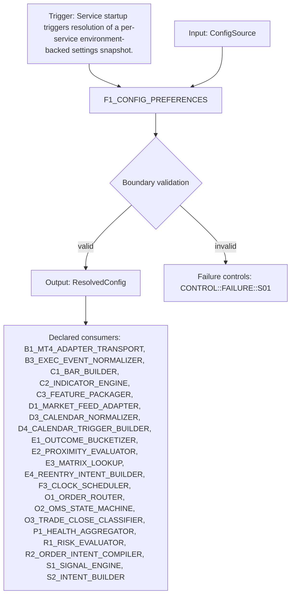

# F1_CONFIG_PREFERENCES

Generated boundary view; execution is not certified.

```mermaid
flowchart TD
  trigger["Trigger: Service startup triggers resolution of a per-service environment-backed settings snapshot."]
  input["Input: ConfigSource"]
  boundary["F1_CONFIG_PREFERENCES"]
  decision{"Boundary validation"}
  output["Output: ResolvedConfig"]
  failure["Failure controls: CONTROL::FAILURE::S01"]
  trigger --> boundary
  input --> boundary
  boundary --> decision
  decision -->|valid| output
  decision -->|invalid| failure
  next["Declared consumers: B1_MT4_ADAPTER_TRANSPORT, B3_EXEC_EVENT_NORMALIZER, C1_BAR_BUILDER, C2_INDICATOR_ENGINE, C3_FEATURE_PACKAGER, D1_MARKET_FEED_ADAPTER, D3_CALENDAR_NORMALIZER, D4_CALENDAR_TRIGGER_BUILDER, E1_OUTCOME_BUCKETIZER, E2_PROXIMITY_EVALUATOR, E3_MATRIX_LOOKUP, E4_REENTRY_INTENT_BUILDER, F3_CLOCK_SCHEDULER, O1_ORDER_ROUTER, O2_OMS_STATE_MACHINE, O3_TRADE_CLOSE_CLASSIFIER, P1_HEALTH_AGGREGATOR, R1_RISK_EVALUATOR, R2_ORDER_INTENT_COMPILER, S1_SIGNAL_ENGINE, S2_INTENT_BUILDER"]
  output --> next
```