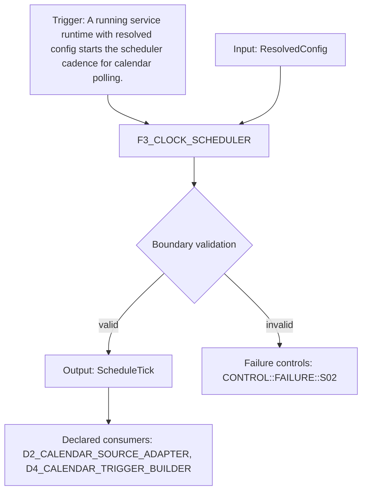

# F3_CLOCK_SCHEDULER

Generated boundary view; execution is not certified.

```mermaid
flowchart TD
  trigger["Trigger: A running service runtime with resolved config starts the scheduler cadence for calendar polling."]
  input["Input: ResolvedConfig"]
  boundary["F3_CLOCK_SCHEDULER"]
  decision{"Boundary validation"}
  output["Output: ScheduleTick"]
  failure["Failure controls: CONTROL::FAILURE::S02"]
  trigger --> boundary
  input --> boundary
  boundary --> decision
  decision -->|valid| output
  decision -->|invalid| failure
  next["Declared consumers: D2_CALENDAR_SOURCE_ADAPTER, D4_CALENDAR_TRIGGER_BUILDER"]
  output --> next
```