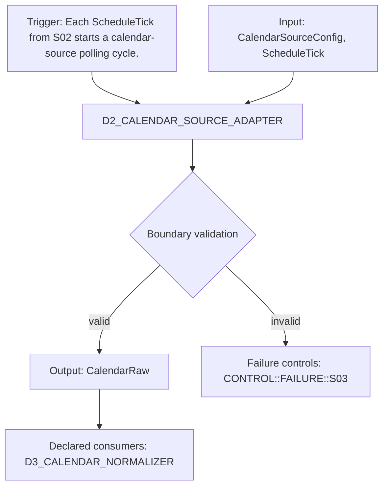

# D2_CALENDAR_SOURCE_ADAPTER

Generated boundary view; execution is not certified.

```mermaid
flowchart TD
  trigger["Trigger: Each ScheduleTick from S02 starts a calendar-source polling cycle."]
  input["Input: CalendarSourceConfig, ScheduleTick"]
  boundary["D2_CALENDAR_SOURCE_ADAPTER"]
  decision{"Boundary validation"}
  output["Output: CalendarRaw"]
  failure["Failure controls: CONTROL::FAILURE::S03"]
  trigger --> boundary
  input --> boundary
  boundary --> decision
  decision -->|valid| output
  decision -->|invalid| failure
  next["Declared consumers: D3_CALENDAR_NORMALIZER"]
  output --> next
```