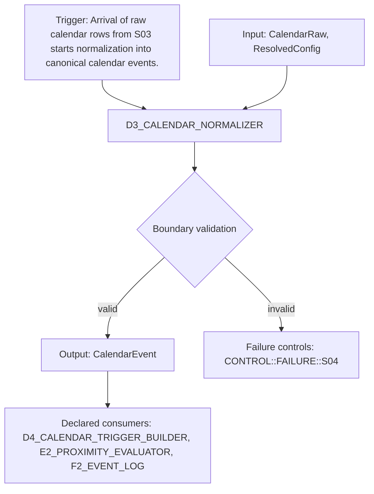

# D3_CALENDAR_NORMALIZER

Generated boundary view; execution is not certified.

```mermaid
flowchart TD
  trigger["Trigger: Arrival of raw calendar rows from S03 starts normalization into canonical calendar events."]
  input["Input: CalendarRaw, ResolvedConfig"]
  boundary["D3_CALENDAR_NORMALIZER"]
  decision{"Boundary validation"}
  output["Output: CalendarEvent"]
  failure["Failure controls: CONTROL::FAILURE::S04"]
  trigger --> boundary
  input --> boundary
  boundary --> decision
  decision -->|valid| output
  decision -->|invalid| failure
  next["Declared consumers: D4_CALENDAR_TRIGGER_BUILDER, E2_PROXIMITY_EVALUATOR, F2_EVENT_LOG"]
  output --> next
```