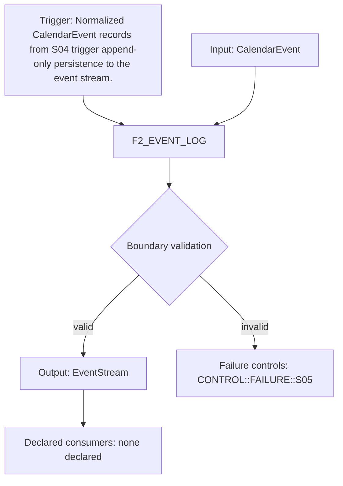

# F2_EVENT_LOG

Generated boundary view; execution is not certified.

```mermaid
flowchart TD
  trigger["Trigger: Normalized CalendarEvent records from S04 trigger append-only persistence to the event stream."]
  input["Input: CalendarEvent"]
  boundary["F2_EVENT_LOG"]
  decision{"Boundary validation"}
  output["Output: EventStream"]
  failure["Failure controls: CONTROL::FAILURE::S05"]
  trigger --> boundary
  input --> boundary
  boundary --> decision
  decision -->|valid| output
  decision -->|invalid| failure
  next["Declared consumers: none declared"]
  output --> next
```