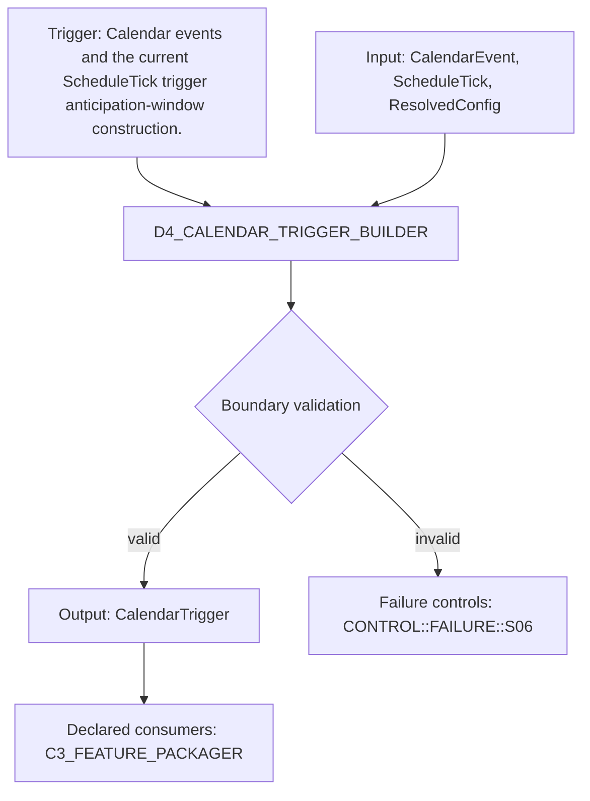

# D4_CALENDAR_TRIGGER_BUILDER

Generated boundary view; execution is not certified.

```mermaid
flowchart TD
  trigger["Trigger: Calendar events and the current ScheduleTick trigger anticipation-window construction."]
  input["Input: CalendarEvent, ScheduleTick, ResolvedConfig"]
  boundary["D4_CALENDAR_TRIGGER_BUILDER"]
  decision{"Boundary validation"}
  output["Output: CalendarTrigger"]
  failure["Failure controls: CONTROL::FAILURE::S06"]
  trigger --> boundary
  input --> boundary
  boundary --> decision
  decision -->|valid| output
  decision -->|invalid| failure
  next["Declared consumers: C3_FEATURE_PACKAGER"]
  output --> next
```