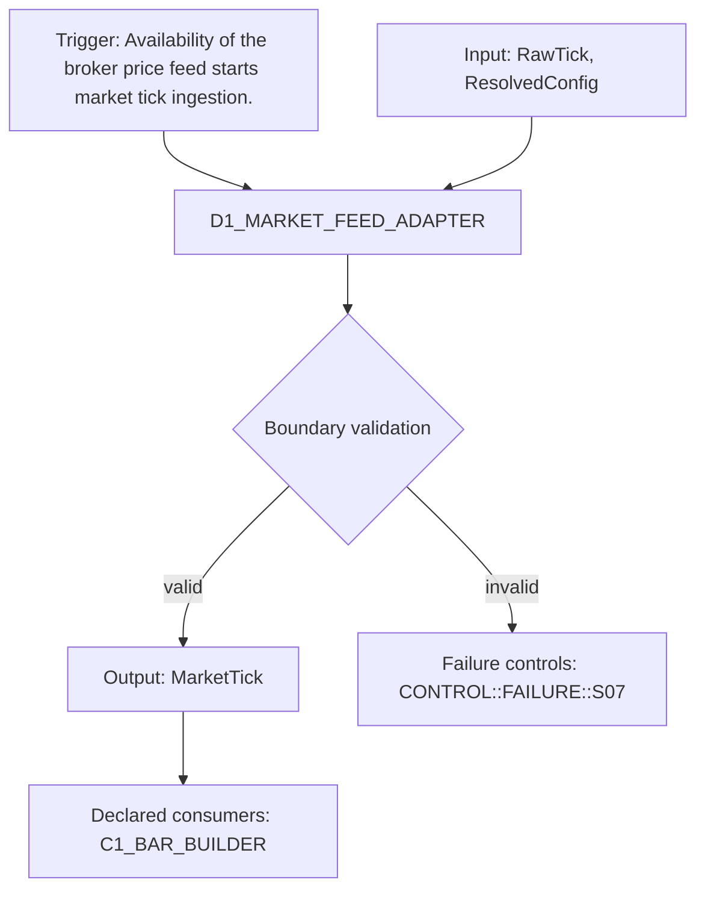

# D1_MARKET_FEED_ADAPTER

Generated boundary view; execution is not certified.

```mermaid
flowchart TD
  trigger["Trigger: Availability of the broker price feed starts market tick ingestion."]
  input["Input: RawTick, ResolvedConfig"]
  boundary["D1_MARKET_FEED_ADAPTER"]
  decision{"Boundary validation"}
  output["Output: MarketTick"]
  failure["Failure controls: CONTROL::FAILURE::S07"]
  trigger --> boundary
  input --> boundary
  boundary --> decision
  decision -->|valid| output
  decision -->|invalid| failure
  next["Declared consumers: C1_BAR_BUILDER"]
  output --> next
```