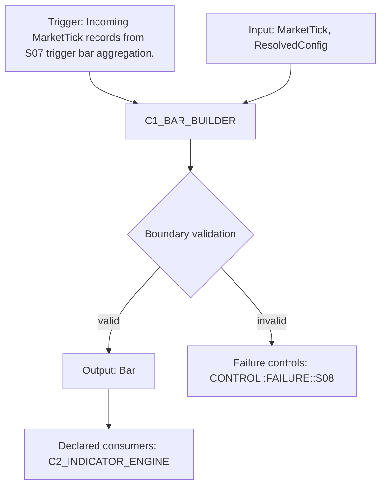

# C1_BAR_BUILDER

Generated boundary view; execution is not certified.

```mermaid
flowchart TD
  trigger["Trigger: Incoming MarketTick records from S07 trigger bar aggregation."]
  input["Input: MarketTick, ResolvedConfig"]
  boundary["C1_BAR_BUILDER"]
  decision{"Boundary validation"}
  output["Output: Bar"]
  failure["Failure controls: CONTROL::FAILURE::S08"]
  trigger --> boundary
  input --> boundary
  boundary --> decision
  decision -->|valid| output
  decision -->|invalid| failure
  next["Declared consumers: C2_INDICATOR_ENGINE"]
  output --> next
```