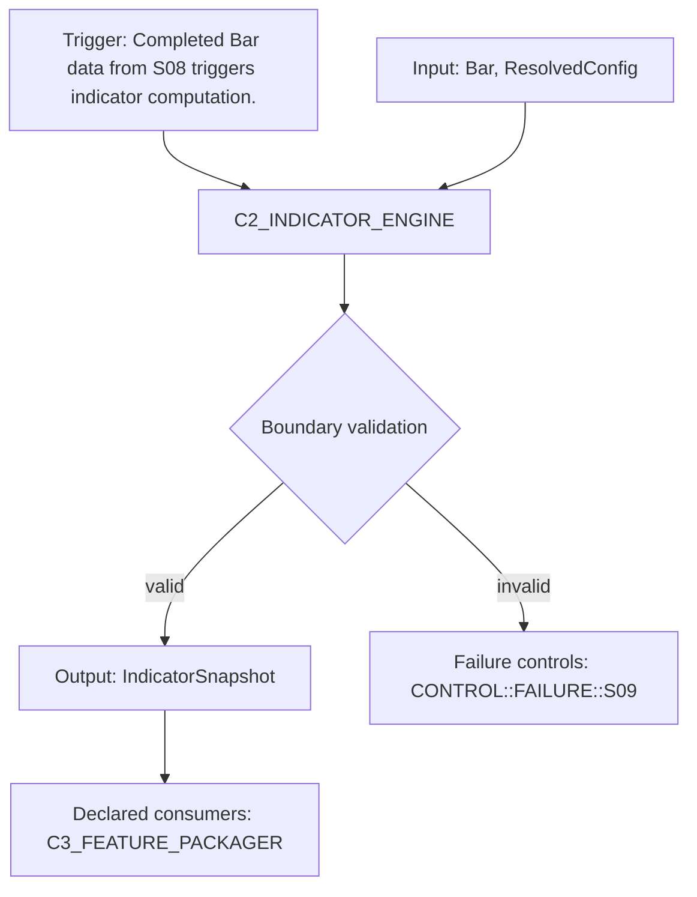

# C2_INDICATOR_ENGINE

Generated boundary view; execution is not certified.

```mermaid
flowchart TD
  trigger["Trigger: Completed Bar data from S08 triggers indicator computation."]
  input["Input: Bar, ResolvedConfig"]
  boundary["C2_INDICATOR_ENGINE"]
  decision{"Boundary validation"}
  output["Output: IndicatorSnapshot"]
  failure["Failure controls: CONTROL::FAILURE::S09"]
  trigger --> boundary
  input --> boundary
  boundary --> decision
  decision -->|valid| output
  decision -->|invalid| failure
  next["Declared consumers: C3_FEATURE_PACKAGER"]
  output --> next
```