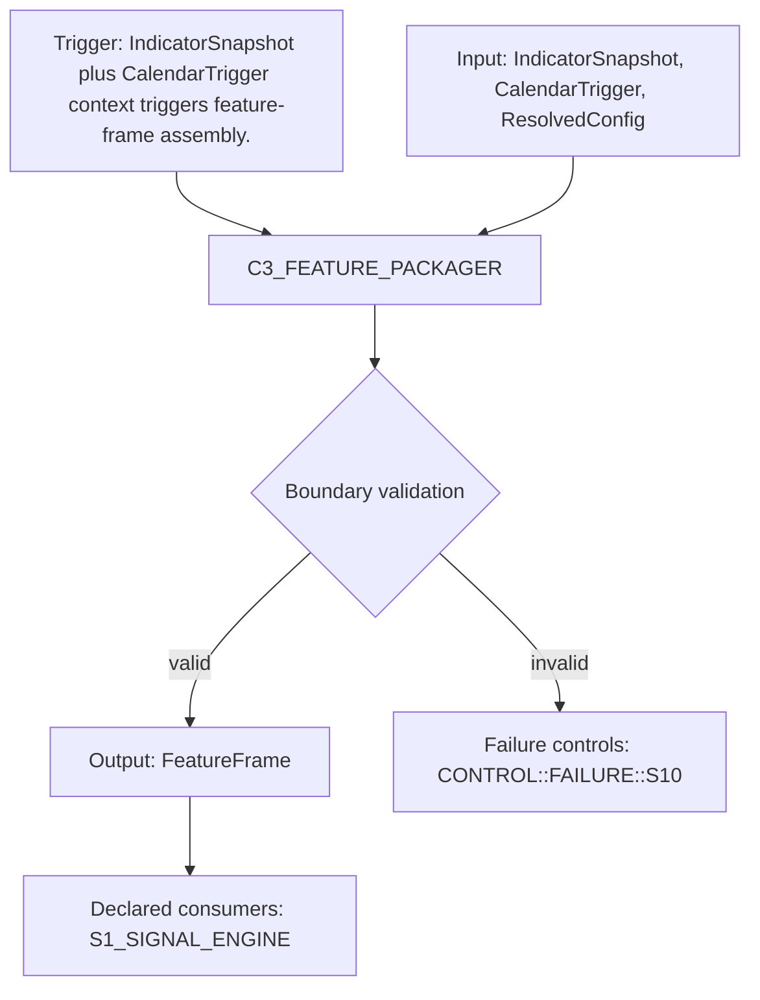

# C3_FEATURE_PACKAGER

Generated boundary view; execution is not certified.

```mermaid
flowchart TD
  trigger["Trigger: IndicatorSnapshot plus CalendarTrigger context triggers feature-frame assembly."]
  input["Input: IndicatorSnapshot, CalendarTrigger, ResolvedConfig"]
  boundary["C3_FEATURE_PACKAGER"]
  decision{"Boundary validation"}
  output["Output: FeatureFrame"]
  failure["Failure controls: CONTROL::FAILURE::S10"]
  trigger --> boundary
  input --> boundary
  boundary --> decision
  decision -->|valid| output
  decision -->|invalid| failure
  next["Declared consumers: S1_SIGNAL_ENGINE"]
  output --> next
```