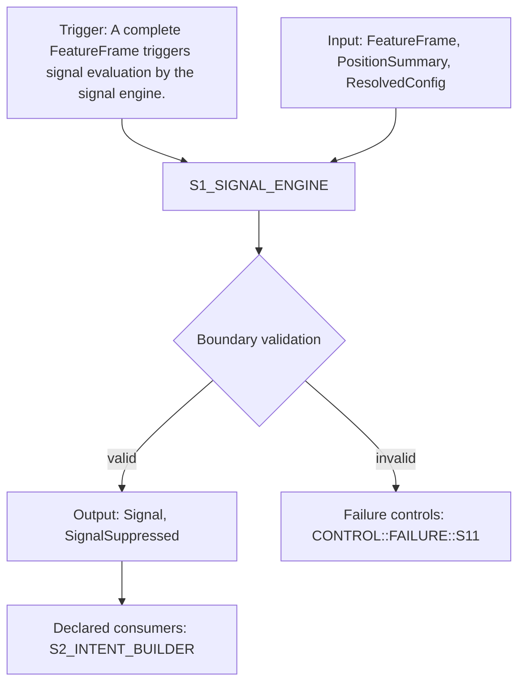

# S1_SIGNAL_ENGINE

Generated boundary view; execution is not certified.

```mermaid
flowchart TD
  trigger["Trigger: A complete FeatureFrame triggers signal evaluation by the signal engine."]
  input["Input: FeatureFrame, PositionSummary, ResolvedConfig"]
  boundary["S1_SIGNAL_ENGINE"]
  decision{"Boundary validation"}
  output["Output: Signal, SignalSuppressed"]
  failure["Failure controls: CONTROL::FAILURE::S11"]
  trigger --> boundary
  input --> boundary
  boundary --> decision
  decision -->|valid| output
  decision -->|invalid| failure
  next["Declared consumers: S2_INTENT_BUILDER"]
  output --> next
```