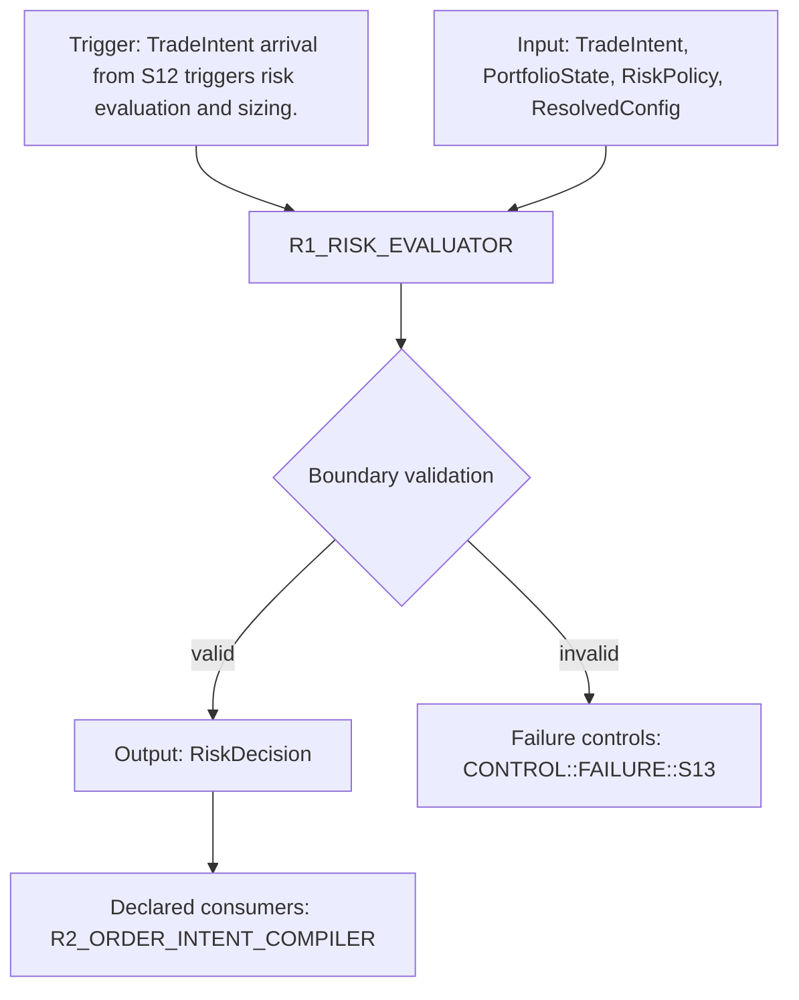

# R1_RISK_EVALUATOR

Generated boundary view; execution is not certified.

```mermaid
flowchart TD
  trigger["Trigger: TradeIntent arrival from S12 triggers risk evaluation and sizing."]
  input["Input: TradeIntent, PortfolioState, RiskPolicy, ResolvedConfig"]
  boundary["R1_RISK_EVALUATOR"]
  decision{"Boundary validation"}
  output["Output: RiskDecision"]
  failure["Failure controls: CONTROL::FAILURE::S13"]
  trigger --> boundary
  input --> boundary
  boundary --> decision
  decision -->|valid| output
  decision -->|invalid| failure
  next["Declared consumers: R2_ORDER_INTENT_COMPILER"]
  output --> next
```