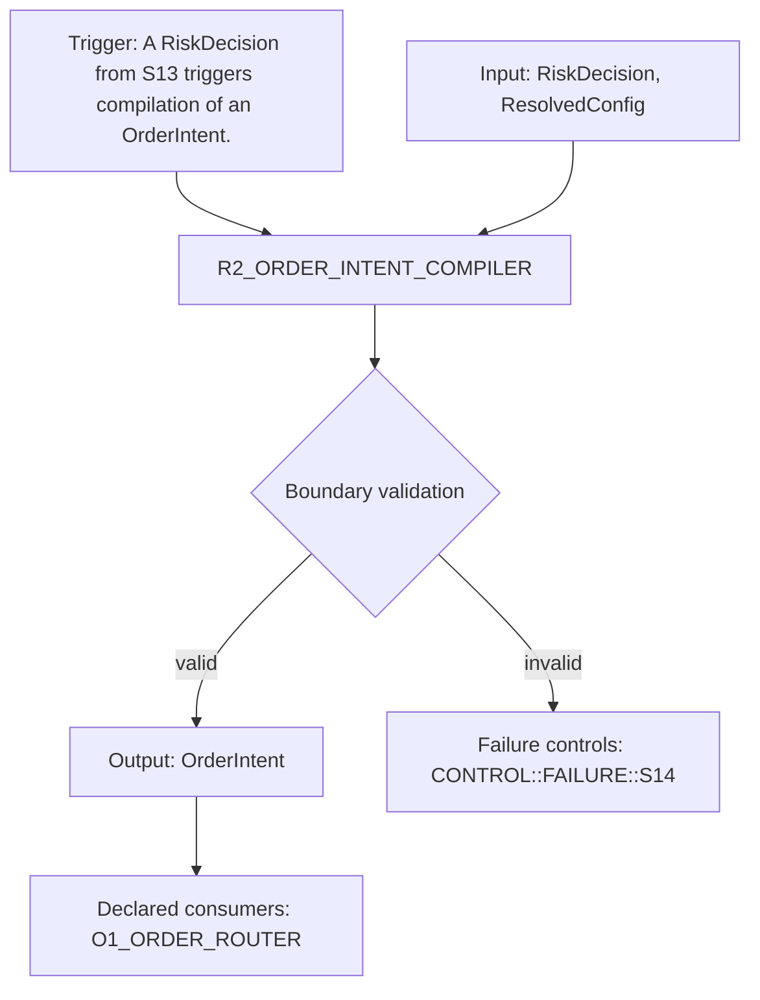

# R2_ORDER_INTENT_COMPILER

Generated boundary view; execution is not certified.

```mermaid
flowchart TD
  trigger["Trigger: A RiskDecision from S13 triggers compilation of an OrderIntent."]
  input["Input: RiskDecision, ResolvedConfig"]
  boundary["R2_ORDER_INTENT_COMPILER"]
  decision{"Boundary validation"}
  output["Output: OrderIntent"]
  failure["Failure controls: CONTROL::FAILURE::S14"]
  trigger --> boundary
  input --> boundary
  boundary --> decision
  decision -->|valid| output
  decision -->|invalid| failure
  next["Declared consumers: O1_ORDER_ROUTER"]
  output --> next
```