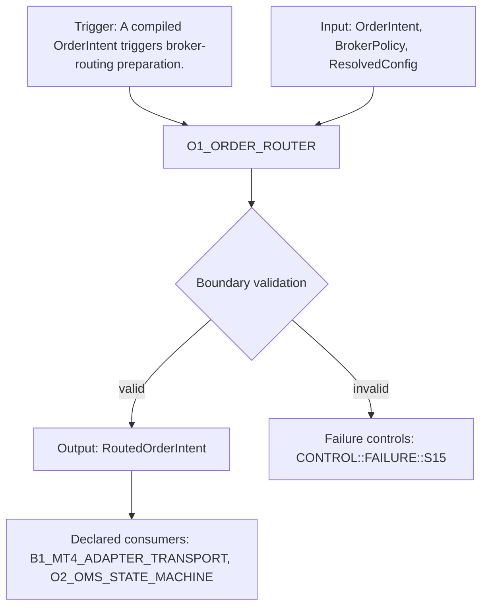

# O1_ORDER_ROUTER

Generated boundary view; execution is not certified.

```mermaid
flowchart TD
  trigger["Trigger: A compiled OrderIntent triggers broker-routing preparation."]
  input["Input: OrderIntent, BrokerPolicy, ResolvedConfig"]
  boundary["O1_ORDER_ROUTER"]
  decision{"Boundary validation"}
  output["Output: RoutedOrderIntent"]
  failure["Failure controls: CONTROL::FAILURE::S15"]
  trigger --> boundary
  input --> boundary
  boundary --> decision
  decision -->|valid| output
  decision -->|invalid| failure
  next["Declared consumers: B1_MT4_ADAPTER_TRANSPORT, O2_OMS_STATE_MACHINE"]
  output --> next
```