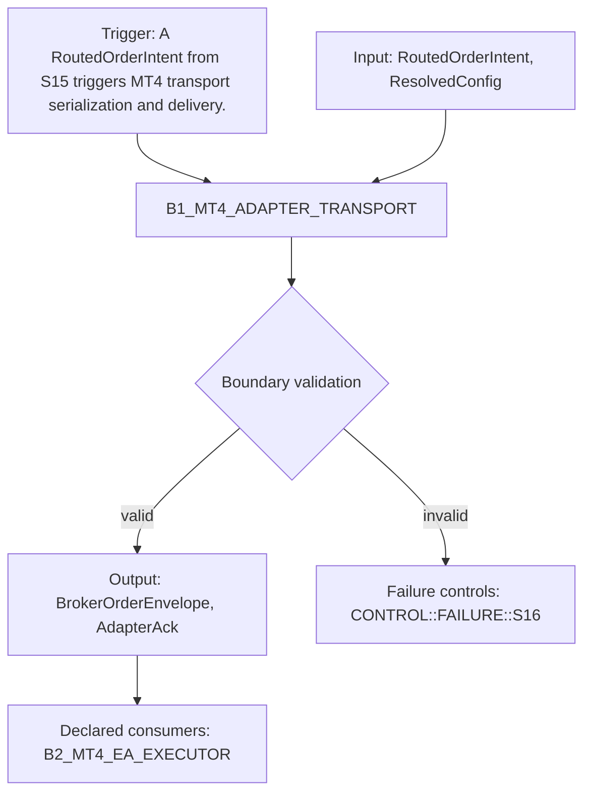

# B1_MT4_ADAPTER_TRANSPORT

Generated boundary view; execution is not certified.

```mermaid
flowchart TD
  trigger["Trigger: A RoutedOrderIntent from S15 triggers MT4 transport serialization and delivery."]
  input["Input: RoutedOrderIntent, ResolvedConfig"]
  boundary["B1_MT4_ADAPTER_TRANSPORT"]
  decision{"Boundary validation"}
  output["Output: BrokerOrderEnvelope, AdapterAck"]
  failure["Failure controls: CONTROL::FAILURE::S16"]
  trigger --> boundary
  input --> boundary
  boundary --> decision
  decision -->|valid| output
  decision -->|invalid| failure
  next["Declared consumers: B2_MT4_EA_EXECUTOR"]
  output --> next
```