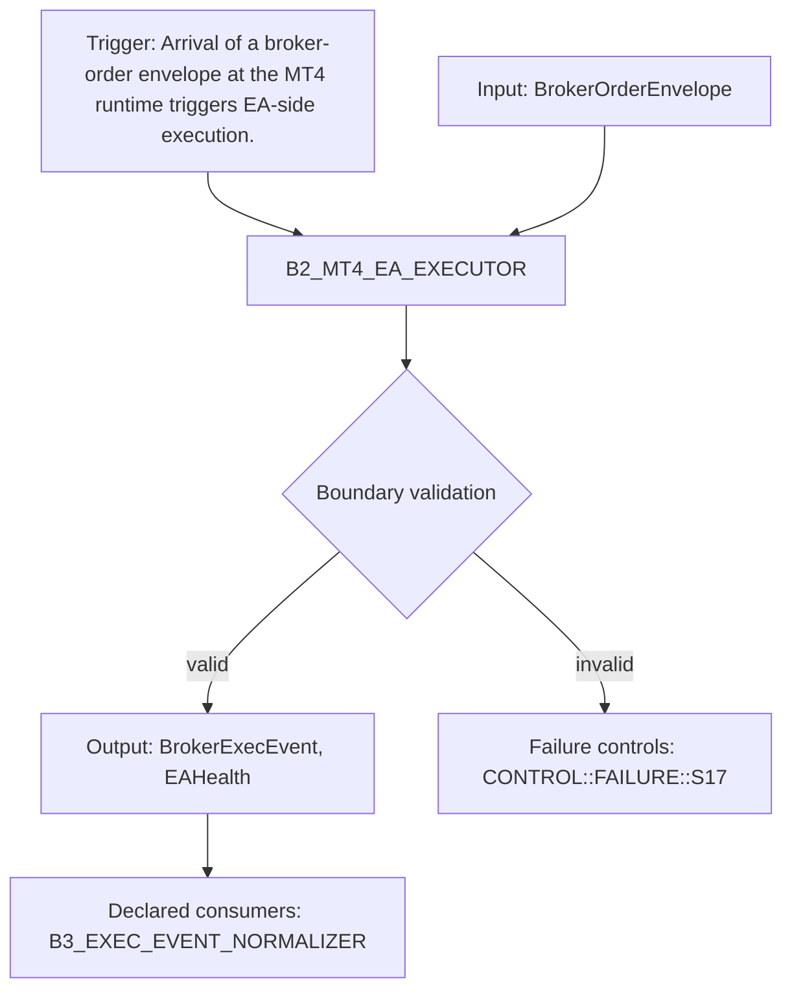

# B2_MT4_EA_EXECUTOR

Generated boundary view; execution is not certified.

```mermaid
flowchart TD
  trigger["Trigger: Arrival of a broker-order envelope at the MT4 runtime triggers EA-side execution."]
  input["Input: BrokerOrderEnvelope"]
  boundary["B2_MT4_EA_EXECUTOR"]
  decision{"Boundary validation"}
  output["Output: BrokerExecEvent, EAHealth"]
  failure["Failure controls: CONTROL::FAILURE::S17"]
  trigger --> boundary
  input --> boundary
  boundary --> decision
  decision -->|valid| output
  decision -->|invalid| failure
  next["Declared consumers: B3_EXEC_EVENT_NORMALIZER"]
  output --> next
```