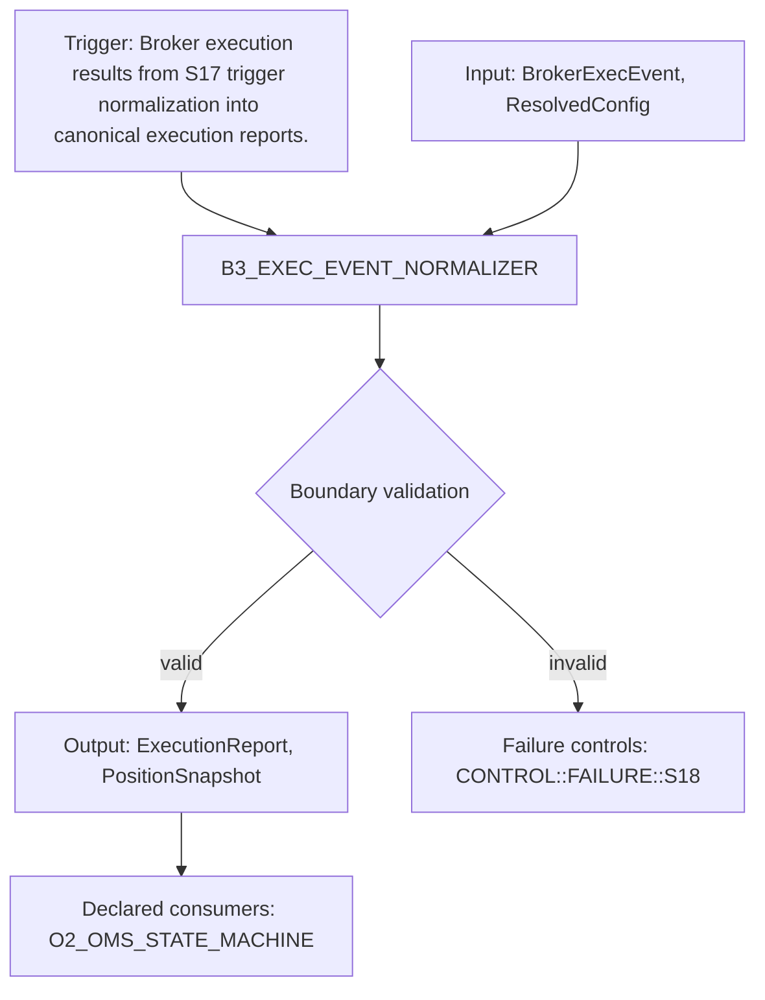

# B3_EXEC_EVENT_NORMALIZER

Generated boundary view; execution is not certified.

```mermaid
flowchart TD
  trigger["Trigger: Broker execution results from S17 trigger normalization into canonical execution reports."]
  input["Input: BrokerExecEvent, ResolvedConfig"]
  boundary["B3_EXEC_EVENT_NORMALIZER"]
  decision{"Boundary validation"}
  output["Output: ExecutionReport, PositionSnapshot"]
  failure["Failure controls: CONTROL::FAILURE::S18"]
  trigger --> boundary
  input --> boundary
  boundary --> decision
  decision -->|valid| output
  decision -->|invalid| failure
  next["Declared consumers: O2_OMS_STATE_MACHINE"]
  output --> next
```