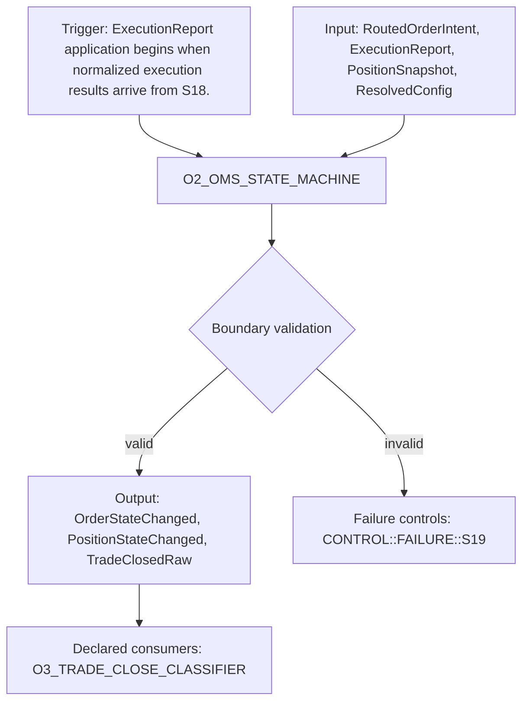

# O2_OMS_STATE_MACHINE

Generated boundary view; execution is not certified.

```mermaid
flowchart TD
  trigger["Trigger: ExecutionReport application begins when normalized execution results arrive from S18."]
  input["Input: RoutedOrderIntent, ExecutionReport, PositionSnapshot, ResolvedConfig"]
  boundary["O2_OMS_STATE_MACHINE"]
  decision{"Boundary validation"}
  output["Output: OrderStateChanged, PositionStateChanged, TradeClosedRaw"]
  failure["Failure controls: CONTROL::FAILURE::S19"]
  trigger --> boundary
  input --> boundary
  boundary --> decision
  decision -->|valid| output
  decision -->|invalid| failure
  next["Declared consumers: O3_TRADE_CLOSE_CLASSIFIER"]
  output --> next
```