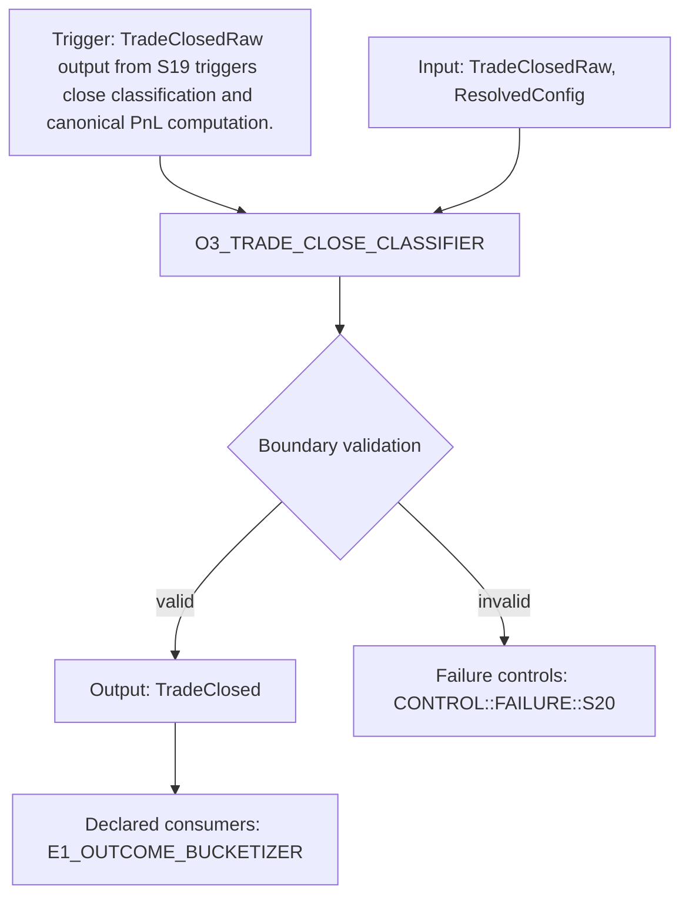

# O3_TRADE_CLOSE_CLASSIFIER

Generated boundary view; execution is not certified.

```mermaid
flowchart TD
  trigger["Trigger: TradeClosedRaw output from S19 triggers close classification and canonical PnL computation."]
  input["Input: TradeClosedRaw, ResolvedConfig"]
  boundary["O3_TRADE_CLOSE_CLASSIFIER"]
  decision{"Boundary validation"}
  output["Output: TradeClosed"]
  failure["Failure controls: CONTROL::FAILURE::S20"]
  trigger --> boundary
  input --> boundary
  boundary --> decision
  decision -->|valid| output
  decision -->|invalid| failure
  next["Declared consumers: E1_OUTCOME_BUCKETIZER"]
  output --> next
```