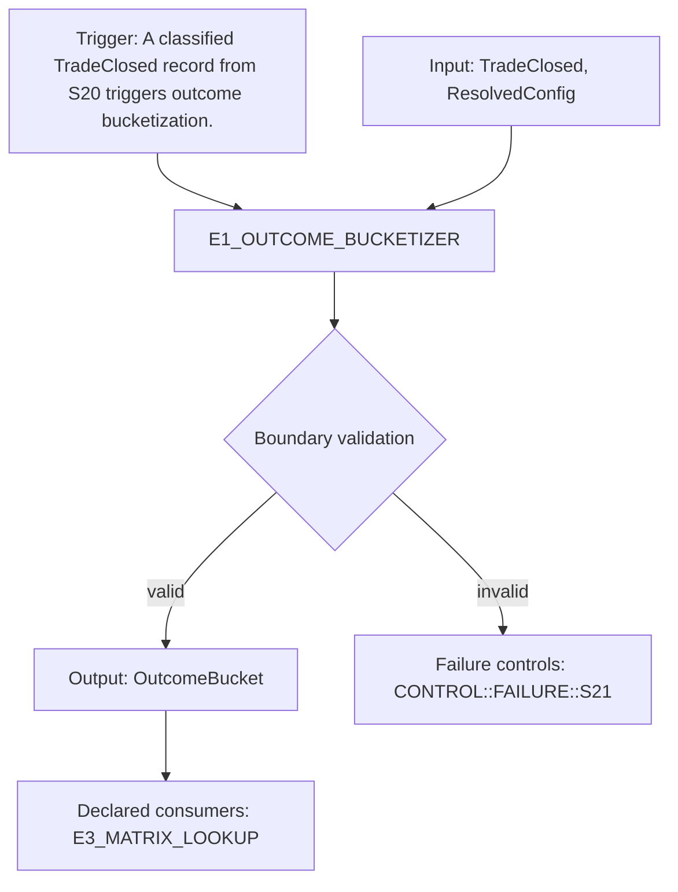

# E1_OUTCOME_BUCKETIZER

Generated boundary view; execution is not certified.

```mermaid
flowchart TD
  trigger["Trigger: A classified TradeClosed record from S20 triggers outcome bucketization."]
  input["Input: TradeClosed, ResolvedConfig"]
  boundary["E1_OUTCOME_BUCKETIZER"]
  decision{"Boundary validation"}
  output["Output: OutcomeBucket"]
  failure["Failure controls: CONTROL::FAILURE::S21"]
  trigger --> boundary
  input --> boundary
  boundary --> decision
  decision -->|valid| output
  decision -->|invalid| failure
  next["Declared consumers: E3_MATRIX_LOOKUP"]
  output --> next
```