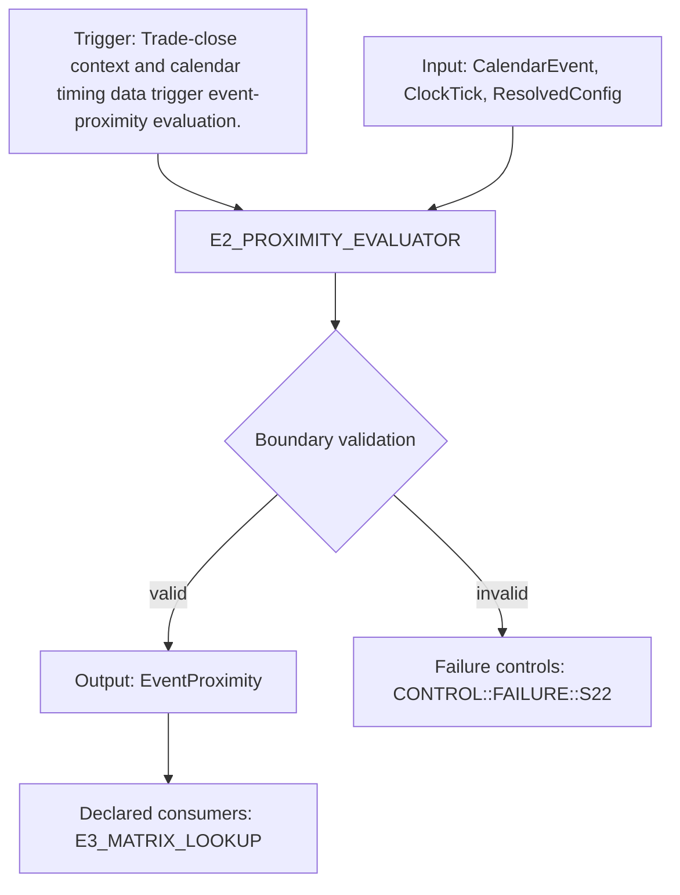

# E2_PROXIMITY_EVALUATOR

Generated boundary view; execution is not certified.

```mermaid
flowchart TD
  trigger["Trigger: Trade-close context and calendar timing data trigger event-proximity evaluation."]
  input["Input: CalendarEvent, ClockTick, ResolvedConfig"]
  boundary["E2_PROXIMITY_EVALUATOR"]
  decision{"Boundary validation"}
  output["Output: EventProximity"]
  failure["Failure controls: CONTROL::FAILURE::S22"]
  trigger --> boundary
  input --> boundary
  boundary --> decision
  decision -->|valid| output
  decision -->|invalid| failure
  next["Declared consumers: E3_MATRIX_LOOKUP"]
  output --> next
```