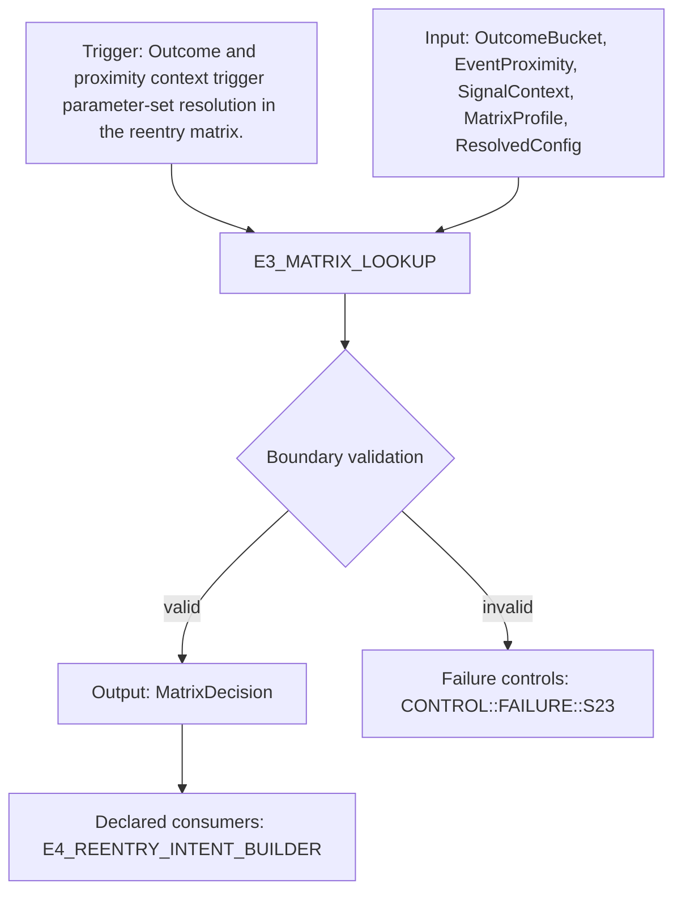

# E3_MATRIX_LOOKUP

Generated boundary view; execution is not certified.

```mermaid
flowchart TD
  trigger["Trigger: Outcome and proximity context trigger parameter-set resolution in the reentry matrix."]
  input["Input: OutcomeBucket, EventProximity, SignalContext, MatrixProfile, ResolvedConfig"]
  boundary["E3_MATRIX_LOOKUP"]
  decision{"Boundary validation"}
  output["Output: MatrixDecision"]
  failure["Failure controls: CONTROL::FAILURE::S23"]
  trigger --> boundary
  input --> boundary
  boundary --> decision
  decision -->|valid| output
  decision -->|invalid| failure
  next["Declared consumers: E4_REENTRY_INTENT_BUILDER"]
  output --> next
```