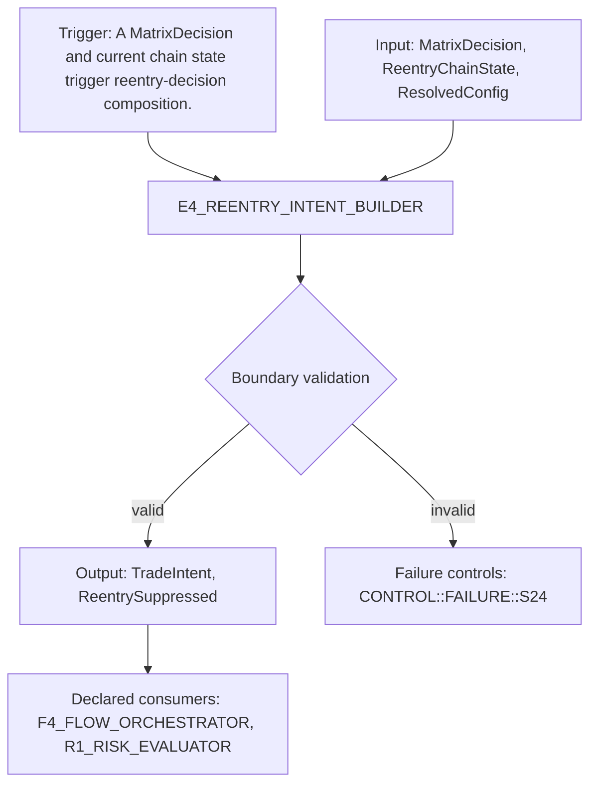

# E4_REENTRY_INTENT_BUILDER

Generated boundary view; execution is not certified.

```mermaid
flowchart TD
  trigger["Trigger: A MatrixDecision and current chain state trigger reentry-decision composition."]
  input["Input: MatrixDecision, ReentryChainState, ResolvedConfig"]
  boundary["E4_REENTRY_INTENT_BUILDER"]
  decision{"Boundary validation"}
  output["Output: TradeIntent, ReentrySuppressed"]
  failure["Failure controls: CONTROL::FAILURE::S24"]
  trigger --> boundary
  input --> boundary
  boundary --> decision
  decision -->|valid| output
  decision -->|invalid| failure
  next["Declared consumers: F4_FLOW_ORCHESTRATOR, R1_RISK_EVALUATOR"]
  output --> next
```