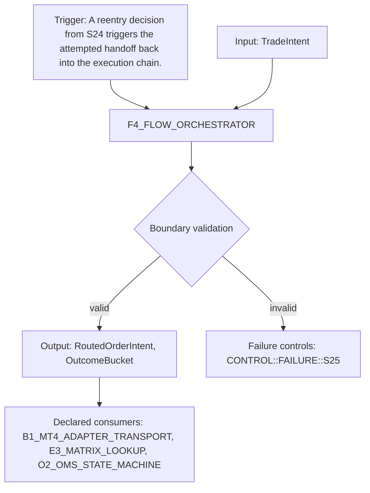

# F4_FLOW_ORCHESTRATOR

Generated boundary view; execution is not certified.

```mermaid
flowchart TD
  trigger["Trigger: A reentry decision from S24 triggers the attempted handoff back into the execution chain."]
  input["Input: TradeIntent"]
  boundary["F4_FLOW_ORCHESTRATOR"]
  decision{"Boundary validation"}
  output["Output: RoutedOrderIntent, OutcomeBucket"]
  failure["Failure controls: CONTROL::FAILURE::S25"]
  trigger --> boundary
  input --> boundary
  boundary --> decision
  decision -->|valid| output
  decision -->|invalid| failure
  next["Declared consumers: B1_MT4_ADAPTER_TRANSPORT, E3_MATRIX_LOOKUP, O2_OMS_STATE_MACHINE"]
  output --> next
```