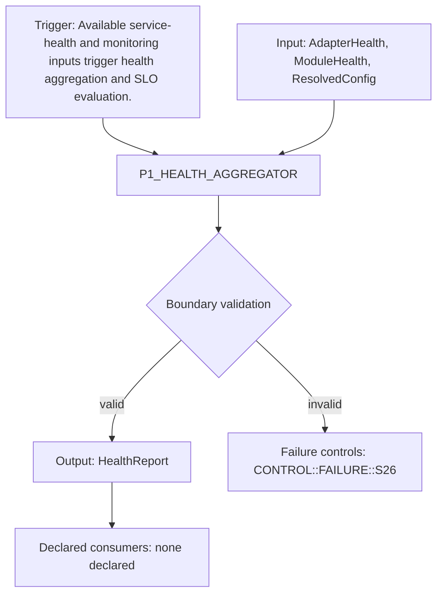

# P1_HEALTH_AGGREGATOR

Generated boundary view; execution is not certified.

```mermaid
flowchart TD
  trigger["Trigger: Available service-health and monitoring inputs trigger health aggregation and SLO evaluation."]
  input["Input: AdapterHealth, ModuleHealth, ResolvedConfig"]
  boundary["P1_HEALTH_AGGREGATOR"]
  decision{"Boundary validation"}
  output["Output: HealthReport"]
  failure["Failure controls: CONTROL::FAILURE::S26"]
  trigger --> boundary
  input --> boundary
  boundary --> decision
  decision -->|valid| output
  decision -->|invalid| failure
  next["Declared consumers: none declared"]
  output --> next
```