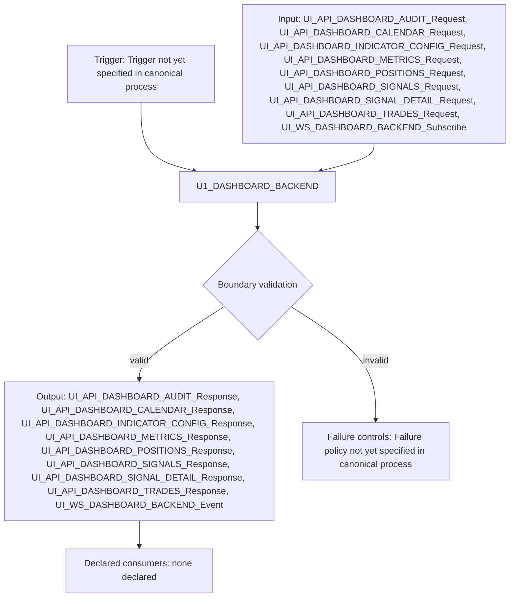

# U1_DASHBOARD_BACKEND

Generated boundary view; execution is not certified.

```mermaid
flowchart TD
  trigger["Trigger: Trigger not yet specified in canonical process"]
  input["Input: UI_API_DASHBOARD_AUDIT_Request, UI_API_DASHBOARD_CALENDAR_Request, UI_API_DASHBOARD_INDICATOR_CONFIG_Request, UI_API_DASHBOARD_METRICS_Request, UI_API_DASHBOARD_POSITIONS_Request, UI_API_DASHBOARD_SIGNALS_Request, UI_API_DASHBOARD_SIGNAL_DETAIL_Request, UI_API_DASHBOARD_TRADES_Request, UI_WS_DASHBOARD_BACKEND_Subscribe"]
  boundary["U1_DASHBOARD_BACKEND"]
  decision{"Boundary validation"}
  output["Output: UI_API_DASHBOARD_AUDIT_Response, UI_API_DASHBOARD_CALENDAR_Response, UI_API_DASHBOARD_INDICATOR_CONFIG_Response, UI_API_DASHBOARD_METRICS_Response, UI_API_DASHBOARD_POSITIONS_Response, UI_API_DASHBOARD_SIGNALS_Response, UI_API_DASHBOARD_SIGNAL_DETAIL_Response, UI_API_DASHBOARD_TRADES_Response, UI_WS_DASHBOARD_BACKEND_Event"]
  failure["Failure controls: Failure policy not yet specified in canonical process"]
  trigger --> boundary
  input --> boundary
  boundary --> decision
  decision -->|valid| output
  decision -->|invalid| failure
  next["Declared consumers: none declared"]
  output --> next
```