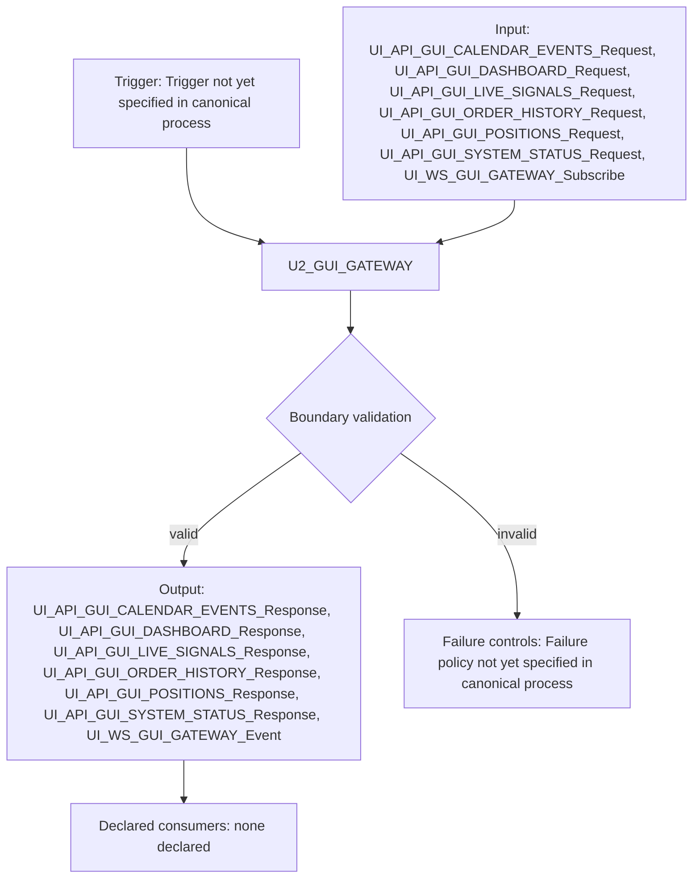

# U2_GUI_GATEWAY

Generated boundary view; execution is not certified.

```mermaid
flowchart TD
  trigger["Trigger: Trigger not yet specified in canonical process"]
  input["Input: UI_API_GUI_CALENDAR_EVENTS_Request, UI_API_GUI_DASHBOARD_Request, UI_API_GUI_LIVE_SIGNALS_Request, UI_API_GUI_ORDER_HISTORY_Request, UI_API_GUI_POSITIONS_Request, UI_API_GUI_SYSTEM_STATUS_Request, UI_WS_GUI_GATEWAY_Subscribe"]
  boundary["U2_GUI_GATEWAY"]
  decision{"Boundary validation"}
  output["Output: UI_API_GUI_CALENDAR_EVENTS_Response, UI_API_GUI_DASHBOARD_Response, UI_API_GUI_LIVE_SIGNALS_Response, UI_API_GUI_ORDER_HISTORY_Response, UI_API_GUI_POSITIONS_Response, UI_API_GUI_SYSTEM_STATUS_Response, UI_WS_GUI_GATEWAY_Event"]
  failure["Failure controls: Failure policy not yet specified in canonical process"]
  trigger --> boundary
  input --> boundary
  boundary --> decision
  decision -->|valid| output
  decision -->|invalid| failure
  next["Declared consumers: none declared"]
  output --> next
```