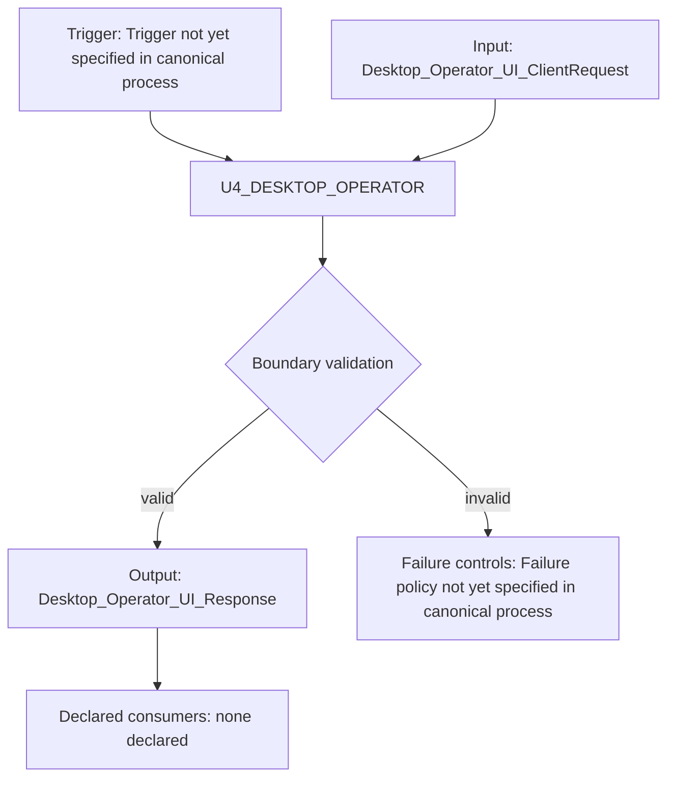

# U4_DESKTOP_OPERATOR

Generated boundary view; execution is not certified.

```mermaid
flowchart TD
  trigger["Trigger: Trigger not yet specified in canonical process"]
  input["Input: Desktop_Operator_UI_ClientRequest"]
  boundary["U4_DESKTOP_OPERATOR"]
  decision{"Boundary validation"}
  output["Output: Desktop_Operator_UI_Response"]
  failure["Failure controls: Failure policy not yet specified in canonical process"]
  trigger --> boundary
  input --> boundary
  boundary --> decision
  decision -->|valid| output
  decision -->|invalid| failure
  next["Declared consumers: none declared"]
  output --> next
```