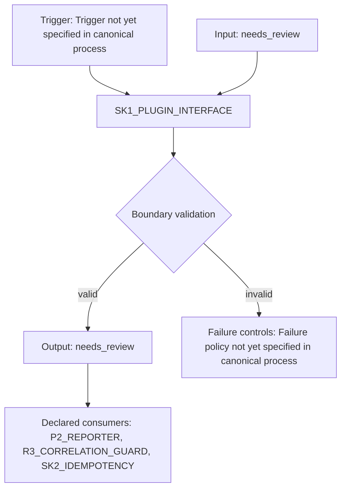

# SK1_PLUGIN_INTERFACE

Generated boundary view; execution is not certified.

```mermaid
flowchart TD
  trigger["Trigger: Trigger not yet specified in canonical process"]
  input["Input: needs_review"]
  boundary["SK1_PLUGIN_INTERFACE"]
  decision{"Boundary validation"}
  output["Output: needs_review"]
  failure["Failure controls: Failure policy not yet specified in canonical process"]
  trigger --> boundary
  input --> boundary
  boundary --> decision
  decision -->|valid| output
  decision -->|invalid| failure
  next["Declared consumers: P2_REPORTER, R3_CORRELATION_GUARD, SK2_IDEMPOTENCY"]
  output --> next
```