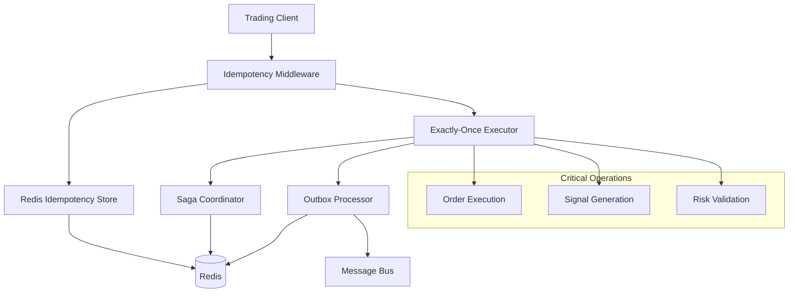

# EAFIX Trading System - Idempotency & Exactly-Once Semantics

This document describes the comprehensive idempotency and exactly-once execution framework implemented for the EAFIX trading system. This framework ensures reliable operation in distributed environments by preventing duplicate operations and guaranteeing exactly-once execution of critical trading operations.

## Overview

The idempotency framework consists of several key components working together to provide robust guarantees:

1. **Idempotency Keys**: Deterministic, collision-resistant identifiers for operations
2. **Distributed Storage**: Redis-based storage with atomic operations and TTL
3. **HTTP Middleware**: Automatic idempotency for FastAPI applications  
4. **Saga Coordinator**: Distributed transaction coordination with compensation
5. **Outbox Pattern**: Reliable event publishing with exactly-once delivery
6. **Exactly-Once Executor**: Coordinated execution of critical operations

## Architecture



## Components

### 1. Idempotency Keys

Deterministic keys that uniquely identify operations based on their parameters:

```python
from shared.idempotency import create_trading_order_key

# Create idempotency key for order
key = create_trading_order_key(
    symbol="EURUSD",
    side="buy", 
    quantity=0.1,
    price=1.0850,
    order_type="limit",
    timestamp=datetime.now(timezone.utc)
)

print(key)  # order_submit:execution-engine:a1b2c3d4e5f6
```

**Key Features:**
- Deterministic hash generation from operation parameters
- Collision-resistant using SHA-256
- Normalized input handling for consistent results
- Support for trading-specific operations (orders, signals, risk validation)

### 2. Redis Idempotency Store

Distributed storage for idempotency records with atomic operations:

```python
from shared.idempotency import RedisIdempotencyStore, IdempotencyRequest

store = RedisIdempotencyStore(redis_client)
await store.initialize()

# Create idempotency request
request = IdempotencyRequest(
    idempotency_key="order_submit:execution-engine:abc123",
    operation_type="order_submit",
    service="execution-engine",
    payload={"symbol": "EURUSD", "side": "buy", "quantity": 0.1}
)

# Atomic check-and-create
response, is_new = await store.check_and_create(request)

if is_new:
    # Execute operation
    result = await execute_operation()
    
    # Update with result
    await store.update_status(
        idempotency_key=request.idempotency_key,
        status="completed",
        result=result
    )
```

**Key Features:**
- Atomic check-and-create operations using Lua scripts
- Automatic expiration with configurable TTL
- Distributed locking to prevent race conditions
- Status tracking (pending, in_progress, completed, failed)
- Built-in retry logic with exponential backoff

### 3. FastAPI Middleware

Automatic idempotency for HTTP requests:

```python
from fastapi import FastAPI
from shared.idempotency import add_idempotency_middleware

app = FastAPI()

# Add idempotency middleware
add_idempotency_middleware(
    app=app,
    idempotency_store=store,
    service_name="execution-engine",
    idempotent_methods={"POST", "PUT", "PATCH"},
    idempotency_header="Idempotency-Key"
)

@app.post("/orders")
async def submit_order(order_data: dict):
    # Automatically handles idempotency
    return await process_order(order_data)
```

**Key Features:**
- Automatic idempotency key extraction from headers
- Request/response caching
- Duplicate request detection with 409 Conflict response
- Configurable per endpoint
- Operation timeout handling

### 4. Saga Coordinator

Distributed transaction coordination with compensation:

```python
from shared.idempotency import SagaCoordinator

coordinator = SagaCoordinator(redis_client)

# Register saga steps
coordinator.register_step(
    step_id="validate_risk",
    name="Validate Risk Parameters", 
    action=validate_risk_func,
    compensation=restore_risk_state_func
)

coordinator.register_step(
    step_id="submit_order",
    name="Submit Order to Broker",
    action=submit_order_func, 
    compensation=cancel_order_func
)

coordinator.register_step(
    step_id="update_position",
    name="Update Position Records",
    action=update_position_func,
    compensation=revert_position_func
)

# Create and execute saga
saga_id = await coordinator.create_saga(
    name="Order Submission Flow",
    steps=["validate_risk", "submit_order", "update_position"],
    initial_context={"order": order_data}
)

result = await coordinator.execute_saga(saga_id)
```

**Key Features:**
- Sequential step execution with automatic compensation on failure
- Retry logic with exponential backoff  
- Distributed coordination using Redis
- Comprehensive error handling and recovery
- Saga state persistence and monitoring

### 5. Outbox Pattern

Reliable event publishing with exactly-once delivery:

```python
from shared.idempotency import OutboxProcessor, OutboxEvent

processor = OutboxProcessor(
    redis_client=redis_client,
    event_publisher=publish_to_message_bus
)

# Store event for reliable publishing
event = OutboxEvent(
    event_type="order_executed",
    aggregate_id="EURUSD",
    aggregate_type="trading_pair", 
    payload={
        "order_id": "12345",
        "symbol": "EURUSD", 
        "side": "buy",
        "quantity": 0.1,
        "price": 1.0850
    },
    topic="trading.orders.executed",
    priority="high"
)

await processor.store_event(event)

# Start processing
await processor.start_processing()
```

**Key Features:**
- Transactional event storage alongside business data
- Reliable event publishing with retry logic
- Dead letter queue for failed events
- Batch processing for efficiency
- Event deduplication and ordering

### 6. Exactly-Once Executor

Coordinated execution of critical operations:

```python
from shared.idempotency import ExactlyOnceExecutor

executor = ExactlyOnceExecutor(
    redis_client=redis_client,
    outbox_processor=outbox_processor,
    idempotency_store=store
)

# Execute order exactly once
result = await executor.execute_trading_order(
    symbol="EURUSD",
    side="buy",
    quantity=0.1,
    price=1.0850, 
    order_type="limit",
    broker_api=broker.submit_order
)

if result.status == "completed":
    print(f"Order executed: {result.result['order_id']}")
else:
    print(f"Order failed: {result.error}")
```

**Key Features:**
- Distributed locking for exclusive operation access
- Automatic result caching and retrieval
- Event publishing integration
- Comprehensive timeout and error handling
- Operation monitoring and metrics

## Integration Examples

### Complete Trading Order Flow

```python
async def setup_trading_system():
    """Complete setup of idempotency-enabled trading system."""
    
    # Initialize components
    redis_client = await redis.from_url("redis://localhost:6379")
    
    # Set up idempotency store
    store = RedisIdempotencyStore(redis_client)
    await store.initialize()
    
    # Set up outbox processor
    outbox = OutboxProcessor(redis_client, publish_events_to_bus)
    await outbox.start_processing()
    
    # Set up exactly-once executor
    executor = ExactlyOnceExecutor(redis_client, outbox, store)
    
    # Set up saga coordinator
    saga = SagaCoordinator(redis_client)
    
    # Register trading saga steps
    saga.register_step(
        step_id="validate_signal",
        name="Validate Trading Signal",
        action=validate_signal,
        compensation=mark_signal_invalid
    )
    
    saga.register_step(
        step_id="check_risk",
        name="Risk Management Check", 
        action=check_risk_limits,
        compensation=restore_risk_state
    )
    
    saga.register_step(
        step_id="execute_order",
        name="Execute Order",
        action=execute_order_with_broker,
        compensation=cancel_order_with_broker
    )
    
    saga.register_step(
        step_id="update_records",
        name="Update Trading Records",
        action=update_position_records,
        compensation=revert_position_records  
    )
    
    return store, outbox, executor, saga

async def process_trading_signal(signal_data: dict):
    """Process trading signal with full idempotency guarantees."""
    
    store, outbox, executor, saga = await setup_trading_system()
    
    # Execute signal generation exactly once
    signal_result = await executor.execute_signal_generation(
        symbol=signal_data["symbol"],
        signal_type=signal_data["signal_type"],
        indicator_values=signal_data["indicators"],
        signal_func=generate_trading_signal,
        signal_args=(signal_data,)
    )
    
    if signal_result.status != "completed":
        return {"error": "Signal generation failed"}
    
    # If signal is positive, execute full trading saga
    if signal_result.result.get("action") in ["buy", "sell"]:
        saga_id = await saga.create_saga(
            name="Complete Trading Flow",
            steps=["validate_signal", "check_risk", "execute_order", "update_records"],
            initial_context={
                "signal": signal_result.result,
                "symbol": signal_data["symbol"]
            }
        )
        
        saga_result = await saga.execute_saga(saga_id)
        
        return {
            "signal_execution_id": signal_result.execution_id,
            "saga_id": saga_id,
            "saga_status": saga_result.status,
            "order_id": saga_result.context.step_results.get("execute_order", {}).get("order_id")
        }
    
    return {
        "signal_execution_id": signal_result.execution_id,
        "action": "no_trade", 
        "reason": signal_result.result.get("reason")
    }
```

### FastAPI Service Integration

```python
from fastapi import FastAPI, Request, Header
from shared.idempotency import add_idempotency_middleware, idempotent

app = FastAPI(title="EAFIX Execution Engine")

# Add idempotency middleware
add_idempotency_middleware(
    app=app,
    idempotency_store=store,
    service_name="execution-engine"
)

@app.post("/orders")
@idempotent(operation_type="order_submit", ttl_seconds=1800)
async def submit_order(
    request: Request,
    order_data: dict,
    idempotency_key: str = Header(..., alias="Idempotency-Key")
):
    """Submit trading order with automatic idempotency."""
    
    # Execute order exactly once
    result = await executor.execute_trading_order(
        symbol=order_data["symbol"],
        side=order_data["side"],
        quantity=order_data["quantity"],
        price=order_data.get("price"),
        order_type=order_data.get("order_type", "market"),
        client_order_id=order_data.get("client_order_id"),
        broker_api=broker_client.submit_order
    )
    
    if result.status == "completed":
        return {
            "execution_id": result.execution_id,
            "order_id": result.result["order_id"],
            "status": "submitted",
            "events_published": len(result.events_published)
        }
    else:
        return {
            "execution_id": result.execution_id,
            "error": result.error,
            "status": result.status
        }

@app.get("/orders/{execution_id}/status")
async def get_order_status(execution_id: str):
    """Get order execution status."""
    
    status = await executor.get_execution_status(execution_id)
    if not status:
        raise HTTPException(status_code=404, detail="Execution not found")
    
    return status
```

## Best Practices

### 1. Idempotency Key Design

- **Use operation parameters**: Include all parameters that affect the operation outcome
- **Include timestamps**: For time-sensitive operations, include timestamp in the key  
- **Normalize inputs**: Ensure consistent key generation regardless of input formatting
- **Avoid sensitive data**: Don't include secrets or passwords in keys

```python
# Good: Includes all relevant parameters
key = create_trading_order_key(
    symbol="EURUSD",
    side="buy", 
    quantity=0.1,
    price=1.0850,
    order_type="limit",
    timestamp=datetime.now(timezone.utc)
)

# Bad: Missing critical parameters
key = create_idempotency_key(
    operation_type="order_submit",
    service="execution-engine", 
    payload={"symbol": "EURUSD"}  # Missing side, quantity, price
)
```

### 2. Error Handling

- **Distinguish transient vs permanent errors**: Retry transient errors, fail permanently for logical errors
- **Use appropriate timeouts**: Set reasonable timeouts for different operation types
- **Implement circuit breakers**: Prevent cascading failures in distributed operations

```python
try:
    result = await executor.execute_exactly_once(
        operation_func=submit_order_to_broker,
        idempotency_key=idempotency_key,
        operation_type="order_execution",
        timeout_seconds=30  # Orders should complete quickly
    )
except BrokerConnectionError:
    # Transient error - will be retried
    logger.warning("Broker connection failed, will retry")
    raise
except InsufficientFundsError:
    # Permanent error - don't retry
    logger.error("Insufficient funds for order")
    await store.update_status(
        idempotency_key=idempotency_key,
        status="failed", 
        error="Insufficient funds"
    )
```

### 3. Monitoring and Observability

- **Track key metrics**: Success rates, duplicate rates, execution times
- **Set up alerts**: Monitor for high failure rates or long execution times
- **Log comprehensive context**: Include idempotency keys and execution IDs in all logs

```python
import structlog

logger = structlog.get_logger(__name__)

async def execute_with_monitoring(operation_func, idempotency_key, **kwargs):
    """Execute operation with comprehensive monitoring."""
    
    start_time = time.time()
    
    try:
        result = await executor.execute_exactly_once(
            operation_func=operation_func,
            idempotency_key=idempotency_key,
            **kwargs
        )
        
        # Log success
        logger.info(
            "Operation executed successfully",
            idempotency_key=idempotency_key,
            execution_id=result.execution_id,
            duration_seconds=result.duration_seconds,
            was_duplicate=result.retry_count > 0
        )
        
        # Record metrics
        metrics.increment("operations.success")
        metrics.histogram("operations.duration", result.duration_seconds)
        
        if result.retry_count > 0:
            metrics.increment("operations.duplicate")
        
        return result
        
    except Exception as e:
        # Log failure
        logger.error(
            "Operation execution failed", 
            idempotency_key=idempotency_key,
            error=str(e),
            duration_seconds=time.time() - start_time
        )
        
        # Record metrics
        metrics.increment("operations.error")
        
        raise
```

### 4. Testing

- **Test idempotency**: Verify that repeated operations produce the same result
- **Test failure scenarios**: Ensure proper compensation and cleanup
- **Test concurrent access**: Verify behavior under concurrent execution

```python
import pytest
import asyncio

@pytest.mark.asyncio
async def test_order_idempotency():
    """Test that duplicate order submissions are handled correctly."""
    
    # Submit order twice with same idempotency key
    idempotency_key = "test_order_123"
    
    result1 = await executor.execute_trading_order(
        symbol="EURUSD",
        side="buy",
        quantity=0.1, 
        idempotency_key=idempotency_key
    )
    
    result2 = await executor.execute_trading_order(
        symbol="EURUSD", 
        side="buy",
        quantity=0.1,
        idempotency_key=idempotency_key  # Same key
    )
    
    # Both should succeed with same result
    assert result1.status == "completed"
    assert result2.status == "completed"
    assert result1.result["order_id"] == result2.result["order_id"]
    assert result1.execution_id == result2.execution_id

@pytest.mark.asyncio
async def test_concurrent_execution():
    """Test concurrent execution of same operation."""
    
    idempotency_key = "concurrent_test_456"
    
    # Start two concurrent executions
    tasks = [
        executor.execute_trading_order(
            symbol="EURUSD",
            side="buy", 
            quantity=0.1,
            idempotency_key=idempotency_key
        )
        for _ in range(2)
    ]
    
    results = await asyncio.gather(*tasks)
    
    # Both should succeed with same result
    assert all(r.status == "completed" for r in results)
    assert results[0].result["order_id"] == results[1].result["order_id"]
```

## Performance Considerations

### Redis Configuration

Optimize Redis for idempotency workloads:

```redis
# Memory optimization
maxmemory 2gb
maxmemory-policy allkeys-lru

# Persistence for durability
save 900 1
save 300 10  
save 60 10000

# Performance tuning
tcp-keepalive 300
timeout 0
```

### Batch Operations

Use batch operations when possible:

```python
# Store multiple events atomically
events = [create_event_1(), create_event_2(), create_event_3()]
await outbox.store_events_batch(events, transaction_key="batch_123")

# Process multiple operations in saga
saga_id = await coordinator.create_saga(
    name="Batch Order Processing",
    steps=["validate_all", "execute_all", "confirm_all"],
    initial_context={"orders": order_list}
)
```

### Resource Management

- **Set appropriate TTLs**: Prevent memory leaks from old idempotency records
- **Monitor Redis memory usage**: Set up alerts for high memory usage
- **Use connection pooling**: Reuse Redis connections across operations
- **Implement cleanup jobs**: Regularly clean up expired records

## Security Considerations

### Idempotency Key Security

- **Don't include sensitive data**: Never include passwords or secrets in keys
- **Use secure hashing**: The framework uses SHA-256 for collision resistance
- **Validate input data**: Always validate inputs before generating keys

### Access Control

- **Secure Redis access**: Use authentication and network isolation
- **Implement authorization**: Ensure only authorized services can create/update records
- **Audit logging**: Log all idempotency operations for security monitoring

## Troubleshooting

### Common Issues

1. **High duplicate rates**: 
   - Check client retry logic
   - Verify idempotency key uniqueness
   - Monitor for race conditions

2. **Long execution times**:
   - Check for resource contention
   - Monitor Redis performance
   - Review operation complexity

3. **Failed compensations**:
   - Check compensation logic
   - Verify external system availability  
   - Review error handling

### Debugging Tools

```python
# Get detailed execution status
status = await executor.get_execution_status(execution_id)
print(f"Status: {status}")

# Get saga progress
saga_status = await coordinator.get_saga_status(saga_id) 
print(f"Saga progress: {saga_status['progress']}")

# Get outbox statistics
outbox_stats = await outbox.get_stats()
print(f"Pending events: {outbox_stats['pending_events']}")

# Get store statistics  
store_stats = await store.get_stats()
print(f"Total records: {store_stats['total_records']}")
```

## References

- [Idempotency in Distributed Systems](https://stripe.com/docs/api/idempotent_requests)
- [Saga Pattern](https://microservices.io/patterns/data/saga.html) 
- [Outbox Pattern](https://microservices.io/patterns/data/transactional-outbox.html)
- [Exactly-Once Delivery](https://kafka.apache.org/documentation/#semantics)